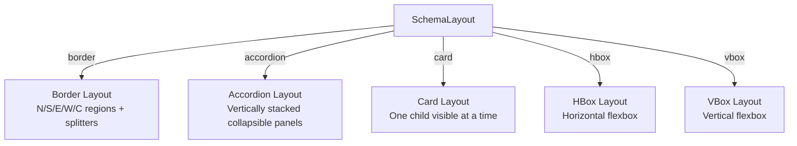
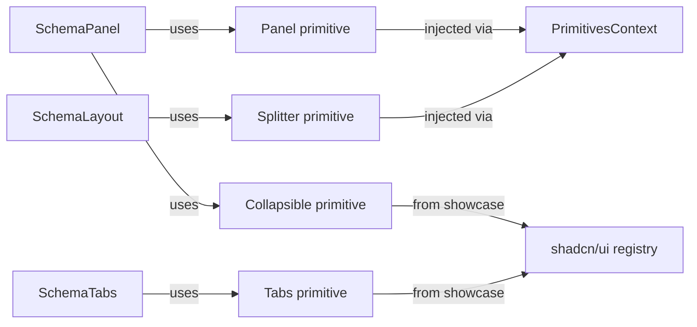

# ADR-007: Layout System Architecture

## Status

Accepted

## Context

The project needs a schema-driven layout system that enables composing entire dashboards and application shells from JSON definitions. This is the defining feature of v0.3.x — inspired by EXT.NET's border layout pattern.

Key design questions:

1. **How do layout regions reference different content types** (forms, grids, wizards, nested layouts)?
2. **How do we handle responsive behavior** — pure CSS, pure schema, or hybrid?
3. **What layout managers do we support** and how are they discriminated?
4. **How do layout state callbacks work** (resize, collapse, tab change)?
5. **How do new primitives (Panel, Splitter) integrate** with the existing `PrimitiveComponents` injection pattern?

## Decision

### 1. ContentSchema Discriminated Union

Layout regions use a **discriminated union** (`ContentSchema`) to reference different content types:

```typescript
export type ContentSchema =
  | { readonly type: 'form'; readonly schema: FormSchema }
  | { readonly type: 'grid'; readonly schema: GridSchema }
  | { readonly type: 'wizard'; readonly schema: WizardSchema }
  | { readonly type: 'tabs'; readonly schema: TabSchema }
  | { readonly type: 'layout'; readonly schema: LayoutSchema }
  | { readonly type: 'custom'; readonly componentKey: string; readonly props?: Readonly<Record<string, unknown>> }
```

The `type` field enables exhaustive pattern matching in the `ContentRenderer` dispatcher. The `'layout'` variant enables recursive nesting (layouts within layouts). The `'custom'` variant provides an escape hatch for user-defined components.

### 2. Hybrid Responsive Strategy (Strategy C)

Responsive behavior follows a **CSS-first, schema-optional** approach:

- **CSS defaults**: Tailwind responsive prefixes (`sm:`, `md:`, `lg:`) handle standard breakpoints via the renderer's default classes
- **Schema overrides**: Each `LayoutRegion` can declare an optional `ResponsiveConfig` with pixel-based breakpoint overrides:
  ```typescript
  export interface ResponsiveConfig {
    readonly hiddenBelow?: number    // Hide region below this width
    readonly collapsedBelow?: number // Collapse region below this width
    readonly stackBelow?: number     // Stack regions vertically below this width
  }
  ```

This avoids duplicating CSS breakpoint logic in JSON while allowing schema authors to override when needed.

### 3. LayoutType Union

Layout managers are discriminated via a string literal union:

```typescript
export type LayoutType = 'border' | 'accordion' | 'card' | 'hbox' | 'vbox'
```

Each type maps to a specific rendering strategy in `SchemaLayout`:



### 4. Layout State Callbacks

Callbacks follow the existing pattern established by `SchemaGrid` (`onColumnOrderChange`) and `SchemaWizard` (`onStepChange`):

```typescript
export interface LayoutRendererProps {
  readonly schema: LayoutSchema
  readonly onRegionResize?: (regionId: string, newSizes: Readonly<Record<string, number>>) => void
  readonly onPanelCollapse?: (regionId: string, collapsed: boolean) => void
}

export interface TabsRendererProps {
  readonly schema: TabSchema
  readonly onTabChange?: (tabId: string) => void
}
```

All callbacks are optional — layout works without them. When provided, they enable parent components to react to layout state changes.

### 5. PrimitiveComponents Injection

New layout primitives (`Panel`, `Splitter`) follow the existing `PrimitivesContext` injection pattern:



- `Panel` and `Splitter` are Layer 1 primitives in `packages/core/src/primitives/`
- Showcase registers shadcn components (Tabs, Accordion, Card, Collapsible, ScrollArea, Resizable) via `primitive-mappings.tsx`
- Engine renderers access primitives through `PrimitivesContext`, never importing directly

## Consequences

### Positive

- **ContentSchema** enables true dashboard composition — any content type can live in any layout region
- **Discriminated union** enables exhaustive pattern matching and type-safe dispatch
- **Hybrid responsive** avoids CSS-in-JSON while allowing schema overrides for edge cases
- **Recursive nesting** (`'layout'` within `ContentSchema`) enables complex dashboard compositions
- **Callback pattern** is consistent with existing grid and wizard callbacks
- **Primitive injection** keeps the core package dependency-free for layout types/validators

### Negative

- **ContentSchema** adds complexity to the `ContentRenderer` dispatcher — must handle 6 content types
- **Schema-driven responsive overrides** require runtime JavaScript to read `ResponsiveConfig` and apply classes, rather than pure CSS media queries
- **Recursive layouts** could lead to deeply nested schemas — need to document best practices
- **New PrimitiveComponents slots** increase the interface surface area (Panel, Splitter, Tabs, Accordion, Card, Collapsible, ScrollArea, Resizable, Separator)

### Risks Mitigated

- Circular type references between `ContentSchema` and `LayoutSchema` mitigated by TypeScript's lazy type evaluation for interfaces
- Performance of recursive layout rendering mitigated by React's component model (each level is an independent render)
- Primitive availability mitigated by `PrimitivesContext` defaults with fallback components