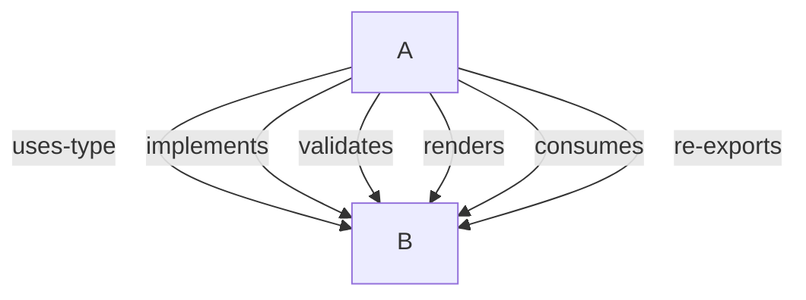
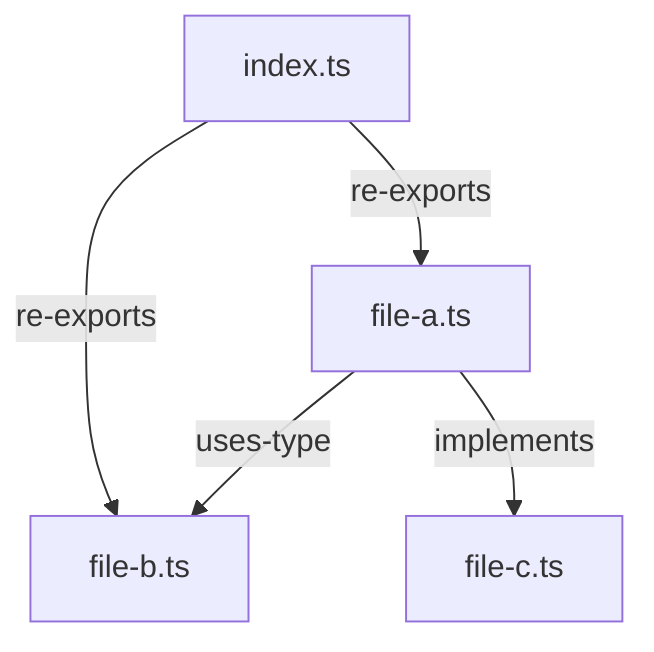

# File Structure & Context Mapping

Enforces a strict one-export-per-file convention with graph-based context maps to maintain AI model awareness across a fragmented file structure. When every type, interface, class, and function lives in its own file, the AI loses co-location context. Context maps solve this by documenting cross-file relationships.

## One Export Per File

Every TypeScript file MUST contain exactly one primary named export. A "primary export" is any `export` declaration that defines a new symbol (type, interface, class, constant, or function).

- Each type, interface, class, enum, or exported function gets its own file
- File names MUST use kebab-case and reflect the export name in snake-case equivalent (e.g., `file-schema.ts` exports `FileSchema`, `validate-file.ts` exports `validateFile`)
- A file MAY contain multiple symbols ONLY if they are co-dependent private helpers used exclusively by the primary export (e.g., a private helper type used only inside the exported function)

### Exceptions

The following file types are exempt from the one-export-per-file rule:

- **Barrel files** (`index.ts`) - exist solely to re-export from other files in the directory
- **Configuration files** (e.g., `vite.config.ts`, `tsconfig.json`, `tailwind.config.ts`)
- **Test files** (`*.test.ts`, `*.test.tsx`, `*.spec.ts`, `*.spec.tsx`)
- **Type-only utility files** that export small shared constants used across many files (e.g., a `constants.ts` with 2-3 string enums). These must be kept small and focused on a single concern.

### What Counts as a Named Export

These count toward the limit:
- `export interface Foo {}`
- `export type Foo = ...`
- `export class Foo {}`
- `export function foo() {}`
- `export const foo = ...`
- `export enum Foo {}`

These do NOT count toward the limit:
- `export default function()` - default exports are separate
- `export { Foo }` from './foo' - re-exports (barrel behavior)
- `export type { Foo }` from './foo' - type re-exports
- Private/non-exported helpers used only within the file

## Folder Structure Conventions

### Directory Organization

Each directory represents a cohesive concern. Files within a directory share a domain or layer:

```
packages/core/src/
  primitives/       -- Layer 1: Generic UI wrappers (no schema knowledge)
    index.ts        -- Barrel re-export
    button.tsx      -- Button primitive
    input.tsx       -- Input primitive
    .context.md     -- Relationship map for this directory

  engine/           -- Layer 2: Schema parsing and rendering (imports Layer 1 only)
    index.ts        -- Barrel re-export
    types/          -- Schema type definitions, one per file
    validators/     -- Zod validators, one per schema type
    renderers/      -- React renderers that consume schemas
    .context.md     -- Relationship map for this directory

apps/showcase/src/
  routes/           -- Layer 3: TanStack Start file-based routes
  components/       -- App-specific components
  .context.md       -- Relationship map for this directory
```

### File Naming Convention

| Export Type | File Name Pattern | Example |
|-------------|-------------------|---------|
| Interface | `kebab-case.ts` | `file-schema.ts` exports `FileSchema` |
| Type Alias | `kebab-case.ts` | `file-type.ts` exports `FileType` |
| Class | `kebab-case.ts` | `data-processor.ts` exports `DataProcessor` |
| Function | `kebab-case.ts` | `validate-file.ts` exports `validateFile` |
| Component | `kebab-case.tsx` | `field-renderer.tsx` exports `FieldRenderer` |
| Enum | `kebab-case.ts` | `field-kind.ts` exports `FieldKind` |
| Constants | `kebab-case.ts` | `default-values.ts` exports `DEFAULT_VALUES` |
| Barrel | `index.ts` | Re-exports all files in directory |

## Context Maps

Context maps are `.context.md` files that document relationships between files. They exist at two levels: per-directory (local) and centralized (global).

### Per-Directory `.context.md` Files

Every directory containing 2+ source files MUST have a `.context.md` file in the same directory. This file documents:

1. **File Inventory** - Every file in the directory, its export name, and export type
2. **Relationships** - Which files in this directory depend on which other files (and why)
3. **External Dependencies** - Files this directory imports from other directories

#### `.context.md` Template

```markdown
# [Directory Name] - Context Map

## File Inventory
| File | Export Name | Export Type | Description |
|------|-------------|-------------|-------------|
| file-name.ts | ExportName | type/instance/function/component | Brief purpose |

## Internal Relationships
- See Mermaid diagram in updated template below for relationship notation

## External Dependencies
- `this-file.ts` imports from `../other-directory/file.ts`
```

#### Relationship Types

Use these standardized tags when documenting relationships:

| Tag | Meaning | Example |
|-----|---------|---------|
| `uses-type` | A imports a type/interface from B | renderer imports schema type |
| `implements` | A implements an interface from B | validator implements schema interface |
| `validates` | A validates the shape defined in B | zod validator validates schema |
| `renders` | A renders UI based on B's data | component renders a schema |
| `re-exports` | A (barrel) re-exports B | index.ts re-exports all files |
| `consumes` | A calls/uses B's function | route calls engine's parse function |

### Centralized `docs/context-map.md`

A single file at `docs/context-map.md` provides the full project-wide relationship graph. It aggregates all per-directory maps into one view, organized by architectural layer.

This file serves as the "bird's-eye view" for understanding how layers and domains connect across the entire project. It is read at task start to give the AI model global context.

### When to Update Context Maps

Context maps MUST be updated whenever:

1. A new file is created in a directory that has a `.context.md`
2. A file is renamed, moved, or deleted
3. A new cross-file import relationship is introduced (file A now imports from file B)
4. An existing relationship is removed

If a new directory is created with 2+ source files, a `.context.md` MUST be created for it immediately.

## Diagram Standards

All structural, relational, and flow-based documentation MUST use Mermaid.js diagrams. ASCII art diagrams and text-arrow notation are prohibited in new documentation.

### Diagram Type Taxonomy

| Use Case | Mermaid Syntax | Example |
|----------|---------------|---------|
| Layer/module dependencies | `graph TD` | Layer 1 → Layer 2 → Layer 3 |
| Data flows | `graph LR` or `graph TD` | Server → Query → Component |
| Request/response lifecycles | `sequenceDiagram` | Client → Server → Client |
| Grouping related components | `subgraph` within `graph` | Grouping types, validators, renderers |

### Where Mermaid is Required

- **`ARCHITECTURE.md`** — All architectural descriptions of layers, flows, and strategies
- **`docs/context-map.md`** — Cross-layer dependency graphs and data flows
- **Per-directory `.context.md` files** — Internal relationship diagrams
- **Implementation plans** — Any structural or flow descriptions in `docs/plans/`

### Prohibited Patterns

Do NOT use the following in new documentation:

- ASCII box-drawing characters for diagrams (`──►`, `│`, `▼`)
- Text-arrow relationship notation (`<-- uses-type -->`)
- Prose-only descriptions where a diagram would be clearer

### Edge Label Convention

Use the standardized relationship types as edge labels in Mermaid diagrams:



### Updated `.context.md` Template

```markdown
# [Directory Name] - Context Map

## File Inventory
| File | Export Name | Export Type | Description |
|------|-------------|-------------|-------------|
| file-name.ts | ExportName | type/instance/function/component | Brief purpose |

## Internal Relationships



## External Dependencies
- `this-file.ts` imports from `../other-directory/file.ts`
```

## Enforcement

When creating or modifying TypeScript files:

1. Check that the file contains only one primary named export (unless it is an exception type listed above)
2. If adding a file to an existing directory, update that directory's `.context.md` immediately
3. If creating a new directory with 2+ source files, create a `.context.md` for it
4. If modifying imports/exports between existing files, update the relationship entries in the relevant `.context.md` files
5. After any structural change, verify the centralized `docs/context-map.md` still reflects the current state
6. All new `.context.md` files MUST use Mermaid diagrams for internal relationships (not text arrows)
7. All new architectural documentation MUST use Mermaid diagrams for structural/relational/flow information
8. ASCII art diagrams are prohibited in new documentation — use Mermaid instead