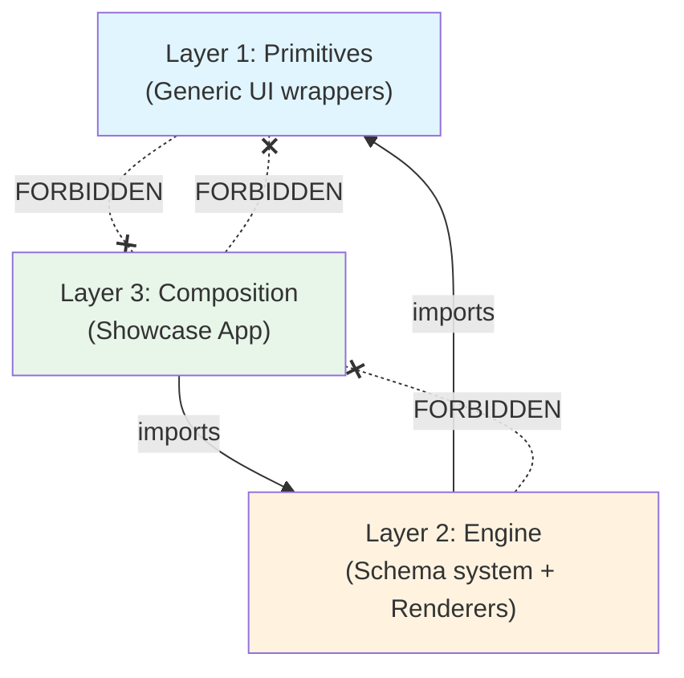
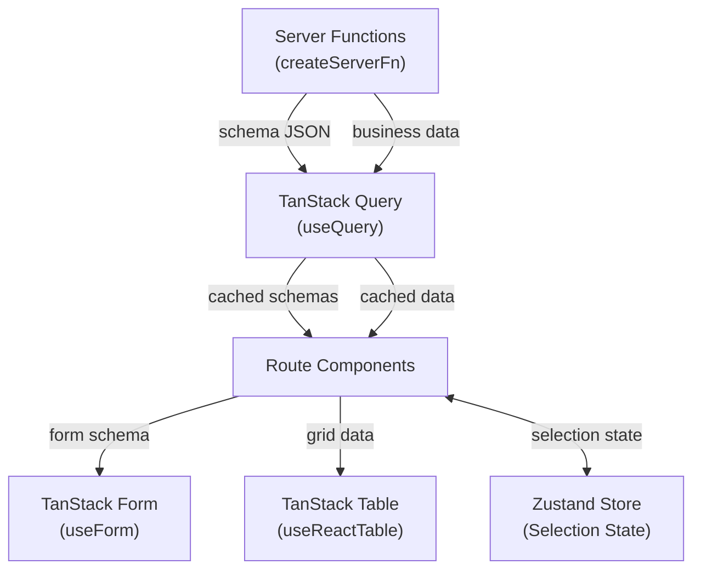
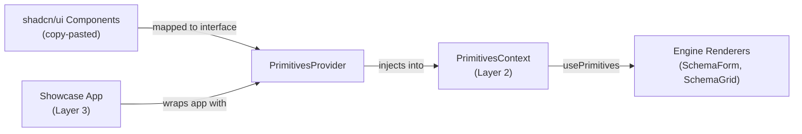
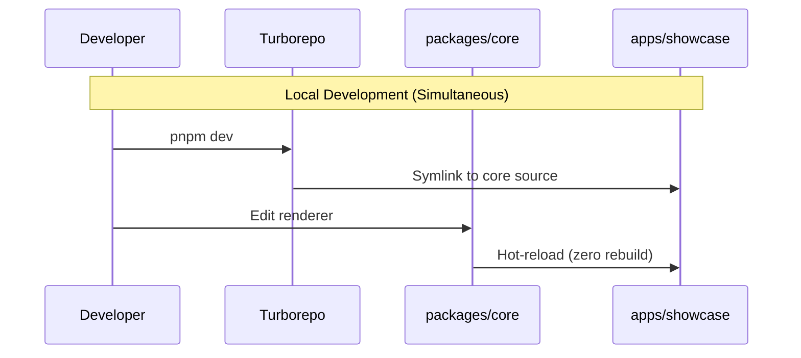
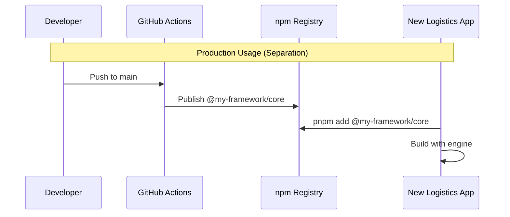
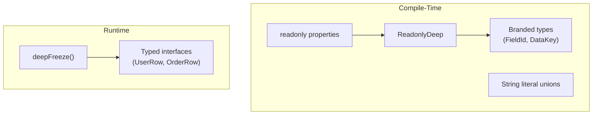
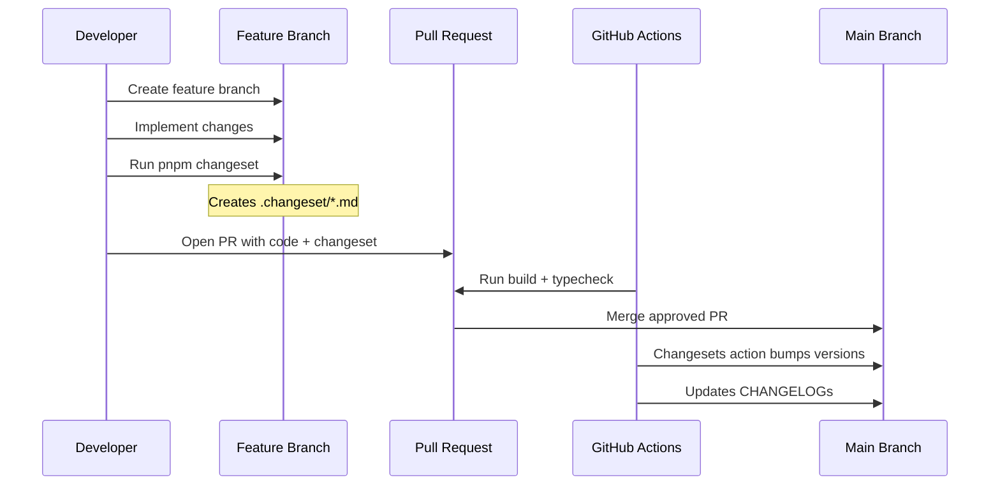

# Architecture Blueprint: Data-Driven UI Framework

## 1. The Core Philosophy

We are not rebuilding Ext.NET's server-side component tree (React forbids this). Instead, we are extracting what made Ext.NET incredibly valuable for logistics: **Configurability** and **Data-Driven UI**.

In this framework, the C# backend (or any backend) owns the **Metadata** (JSON Schemas defining grids and forms), while the React frontend owns the **Rendering**. This allows screens to be modified per customer, permission, or workflow without deploying frontend code.

## 2. The 3-Layer Architecture

The framework relies on a strict, one-way dependency chain. A higher layer can import a lower layer, but never vice-versa.

### Layer 1: Primitives (The Raw Materials)

- **What it is:** Generic, highly reusable component wrappers. The primitives layer exports the `PrimitiveComponents` interface and a `PrimitivesContext` used to inject shadcn/ui components from Layer 3. Bespoke wrappers include `StatusBadge`, `AddressInput`, and `FileUpload`.
- **Rule:** These know nothing about JSON schemas. They just accept standard React props.

### Layer 2: The Engine (The "Ext.NET" Brain)

- **What it is:** The schema system. It contains the TypeScript interfaces defining what a schema is (`FieldSchema`, `GridColumnSchema`, `FieldCondition`, `StatusConfig`, etc.) in individual files under `types/`, the Zod validators in `validators/`, the `PrimitivesContext` provider, and the `SchemaForm`/`SchemaGrid` renderers.
- **How it works:** The `FieldRenderer` acts as a switchboard, reading a schema `type: 'select'` and rendering the injected `<Select>` component from `PrimitivesContext`. `SchemaGrid` uses `@tanstack/react-table` under the hood for sorting, filtering, pagination, column resizing, column visibility, and status badge rendering. `SchemaForm` uses `@tanstack/react-form` for field-level validation, dirty-state tracking, and conditional visibility. Helper renderers `GridPagination`, `GridColumnHeader`, and `GridToolbar` modularize grid concerns.

### Layer 3: Composition (The App/Showcase)

- **What it is:** The actual page files (TanStack Start file-based routes) and server functions (`createServerFn`).
- **How it works:** This layer fetches the JSON schema from mock TanStack server functions via `TanStack Query` (`useQuery`), fetches the actual business data the same way, and passes both into the Layer 2 Engine renderers. Zustand stores manage UI selection state.

### Layer Dependency Diagram



## 3. The Monorepo Structure

```
schema-framework/                  # <- ONE SINGLE GIT REPO
├── apps/
│   └── showcase/                  # <- LAYER 3 (Composition)
│       ├── src/
│       │   ├── routes/            #     TanStack Start file-based routes
│       │   ├── server/            #     Mock TanStack server functions (schemas + data)
│       │   ├── data/              #     Static mock JSON schemas and data
│       │   ├── stores/            #     Zustand stores (selection state)
│       │   ├── lib/               #     Shared utilities (query-client, utils)
│       │   ├── app/               #     App-level config (CSS, primitives-provider)
│       │       ├── components/    #       shadcn/ui components (copy-pasted)
│       │       └── primitives-provider.tsx  # Wires shadcn → PrimitivesContext
│       │   └── client.tsx         #     Entry point
│       └── package.json           #     Depends on "@my-framework/core"
│
├── packages/
│   └── core/                      # <- LAYERS 1 & 2 (The npm library)
│       ├── src/
│       │   ├── primitives/        #     Layer 1: PrimitiveComponents interface, context
│       │   ├── engine/            #     Layer 2: Types, validators, renderers
│       │   │   ├── types/         #       Individual type files (one-export-per-file)
│       │   │   │   └── index.ts   #         Barrel re-export
│       │   │   ├── validators/    #       Individual validator files (one-export-per-file)
│       │   │   │   └── index.ts   #         Barrel re-export
│       │   │   ├── context/       #       PrimitivesContext (shadcn injection)
│       │   │   ├── helpers/       #       i18n helper, deepFreeze utility
│       │   │   └── renderers/     #       SchemaForm, SchemaGrid, FieldRenderer
│       │   └── index.ts           #     Public API exports
│       └── package.json           #     Name: "@my-framework/core"
│
├── docs/                          #     Architecture docs, plans, and status
│   ├── decisions/                 #     ADRs and architectural decisions
│   ├── implementation-status.md   #     Phase-by-phase implementation progress
│   ├── context-map.md             #     Project-wide relationship graph
│   └── plans/                     #     Implementation plans
├── pnpm-workspace.yaml            #     Links apps and packages
├── turbo.json                     #     Orchestrates builds
└── package.json
```

## 4. State Management Strategy

We replace the monolithic Ext JS "Store" with a modern, separated approach:

| Ext.NET Concept | Modern TanStack Equivalent | Purpose |
| :--- | :--- | :--- |
| **Store (Data)** | `TanStack Query` (`useQuery`) | Fetches and caches the actual business data (e.g., list of shipments). |
| **Store (Metadata)** | `TanStack Query` (`useQuery`) | Fetches the JSON Schema defining the UI layout. Treated as read-only. |
| **Store (Selection)** | **Zustand** (Global Store) | Tracks UI state (e.g., "Which row is currently clicked?"). Shared across sibling components. |
| **Store (Dirty State)** | **TanStack Form** (`useForm`) | Tracks if the user typed in a form field, handles validation, and knows exactly what changed. |
| **Table State (Sort/Page)** | **TanStack Table** (`useReactTable`) | Manages grid sorting, column visibility, and row model state. |

### State Management Data Flow



## 5. The "Shadcn Dependency" Rule

Because shadcn/ui is copy-pasted code (not an npm package), your `packages/core` library cannot hardcode import paths to shadcn files.

**The Solution:** A `PrimitivesContext` in Layer 2 that accepts all required UI components. The Showcase app (Layer 3) wraps the app in a provider that maps shadcn/ui components to the `PrimitiveComponents` interface.

```typescript
// packages/core/src/engine/context/primitives-context.tsx
// Defines PrimitiveComponents interface and PrimitivesContext

// packages/core/src/engine/renderers/schema-grid.tsx
// Consumes injected components:
import { usePrimitives } from '../context/primitives-context'

export function SchemaGrid({ schema, data, onRowClick }) {
  const { Table, TableHeader, TableBody, TableRow, TableHead, TableCell } =
    usePrimitives()
  // render using these injected components
}

// apps/showcase/src/app/primitives-provider.tsx
// Layer 3 wires shadcn into the engine:
import { PrimitivesProvider } from '@my-framework/core'
import { Table, TableHeader, ... } from './components/ui/table'

export function AppPrimitivesProvider({ children }) {
  return (
    <PrimitivesProvider value={{ Table, TableHeader, ..., Button }}>
      {children}
    </PrimitivesProvider>
  )
}
```

This makes the framework agnostic to the end-user's specific shadcn theme or file structure.

### Shadcn Injection Flow



## 6. Workflow & Lifecycle

### Local Development (Simultaneous)

1. You run `pnpm dev` in the root.
2. Turborepo creates a symlink: the Showcase app directly points to the Core package source code.
3. You edit `packages/core/src/engine/renderers/field-renderer.tsx`.
4. You hit save. The Showcase app instantly hot-reloads. Zero rebuilds required during development.

### Production Usage (Separation)

1. You finish a feature and push to the main branch.
2. GitHub Actions triggers.
3. It builds `packages/core` and publishes it to your private npm registry (e.g., `@my-framework/core@1.0.2`).
4. Later, you create a brand new Logistics App (`npx create-tanstack-start`).
5. You run `pnpm add @my-framework/core`.
6. You build your logistics app using the engine you built.

For phase-by-phase implementation progress, see [`docs/implementation-status.md`](docs/implementation-status.md).

### Workflow Diagrams





## 7. Immutability Strategy

All schema types enforce immutability at two levels: compile-time via `ReadonlyDeep<T>` on array/object properties, and runtime via `deepFreeze<T>()`.

### Compile-Time: `ReadonlyDeep<T>`

Schema type interfaces use `readonly` on all properties. Arrays and nested objects use `ReadonlyDeep<T>` to recursively enforce immutability:

```typescript
// Applied at definition site for array/nested object properties
interface FormSchema {
  readonly fields: ReadonlyArray<ReadonlyDeep<FieldSchema>>
  readonly layout?: 'stack' | 'grid'
}
```

### Runtime: `deepFreeze<T>()`

The `deepFreeze()` utility recursively calls `Object.freeze()` on all objects and arrays. All mock schema constants in the showcase app are wrapped with `deepFreeze()`:

```typescript
import { deepFreeze } from '@my-framework/core'

export const contactFormSchema = deepFreeze<FormSchema>({ ... })
```

### Branded Types

`FieldId` and `DataKey` are branded string types that prevent accidental string interchange:

```typescript
type FieldId = Brand<string, 'FieldId'>
type DataKey = Brand<string, 'DataKey'>
```

### Typed Data Interfaces

Showcase mock data uses typed interfaces (`UserRow`, `OrderRow`) instead of `Record<string, unknown>[]`. All properties are `readonly`.

### String Literal Unions

`ConditionOperator` and `ValidationType` replace bare `string` in validators with explicit string literal unions:

```typescript
type ConditionOperator = 'equals' | 'notEquals' | 'in' | 'notIn' | 'truthy' | 'falsy'
type ValidationType = 'required' | 'email' | 'minLength' | 'maxLength' | 'pattern' | 'min' | 'max' | 'custom'
```

### Immutability Layers



## 8. Decision Records

Architectural decisions are tracked in `docs/decisions/` using the ADR (Architectural Decision Record) format. Each decision includes Status, Context, Decision, and Consequences sections.

See [`docs/decisions/README.md`](docs/decisions/README.md) for the full index and format specification.

## 9. Version Strategy

This project follows **Semantic Versioning (SemVer)** with **Changesets** for monorepo version management.

### Version Phases

| Phase | Range | API Stability |
|-------|-------|---------------|
| Development | `0.x.x` | Unstable. Breaking changes allowed in any version. |
| Stable | `1.x.x+` | Strict SemVer. Breaking changes require MAJOR bump. |

### Tooling

- **Changesets** (`@changesets/cli`) — version bumping, CHANGELOG generation, npm publishing
- **GitHub Actions** — automated CI (test + build) and release (version + publish) pipelines
- **Branch Protection** — no direct pushes to `main`, all changes via PR

### Workflow



### Branching Convention

| Branch Pattern | Purpose | Example |
|----------------|---------|---------|
| `feature/*` | New feature development | `feature/v0.2.0-date-picker` |
| `fix/*` | Bug fixes | `fix/grid-pagination-off-by-one` |
| `docs/*` | Documentation changes | `docs/getting-started-guide` |
| `release/*` | Release preparation | `release/v0.2.0` |

All branches merge to `main` via Pull Request. Direct commits to `main` are forbidden.

### Roadmap

The full version roadmap is located at `docs/roadmap.md`. Current milestone status is tracked in `docs/VERSION_STATUS.md`.

---

## Appendix A: AI-README Template

When creating a new folder, use this exact structure. No fluff. No friendly intros. Just constraints and mappings.

```markdown
# [FOLDER_NAME]

## Purpose

[1 sentence: What is this folder responsible for in the 3-Layer Architecture?]

## Dependencies (Imports FROM)

[List exactly which layers/folders this folder is allowed to import from]

## Dependents (Imported BY)

[List which layers/folders are allowed to import this]

## Constraints

- [Rule 1]
- [Rule 2]

## 🚫 FORBIDDEN

- [Action 1 that must NEVER happen here]
- [Action 2 that must NEVER happen here]
```

## Appendix B: Package Configuration

### `packages/core/package.json`

```json
{
  "name": "@my-framework/core",
  "type": "module",
  "main": "./dist/index.js",
  "types": "./dist/index.d.ts",
  "exports": {
    ".": {
      "import": "./dist/index.js",
      "types": "./dist/index.d.ts"
    },
    "./primitives": "./dist/primitives/index.js",
    "./engine": "./dist/engine/index.js"
  },
  "scripts": {
    "build": "tsup src/index.ts --format esm --dts"
  }
}
```

> NOTE: We use `tsup` instead of `tsc` because it handles bundling TypeScript declarations and ESM natively with zero config, which is vital for monorepos.

### `packages/core/tsconfig.json`

```json
{
  "compilerOptions": {
    "strict": true,
    "declaration": true,
    "declarationMap": true,
    "sourceMap": true,
    "outDir": "./dist",
    "rootDir": "./src"
  },
  "include": ["src"]
}
```

> WARNING: There is NO path aliasing here. Strict relative imports only.

## Appendix C: State Management Interfaces

When building the Zustand stores for the Showcase app, they must follow this generic pattern to remain decoupled from specific business logic:

```typescript
// Generic Selection Store — instantiated per feature via createSelectionStore()
interface SelectionStore<T = unknown> {
  selectedId: string | null
  selectedData: T | null
  setSelected: (id: string, data: T) => void
  clearSelection: () => void
}
```

Do not create stores like `useShipmentStore`. Use `createSelectionStore` and instantiate it per feature if necessary, or keep it global to the page layout.

## Appendix D: Server Functions & Serialization

TanStack Start server functions (`createServerFn`) return values over the network. All schema types and data returned from server functions **must be serializable** (no functions, no `unknown`, no `ReactNode`).

- `GridColumnSchema` intentionally does **not** have a `render` property. Custom cell rendering is a client-side concern handled by the `SchemaGrid` renderer based on column `type`.
- `FieldSchema.defaultValue` is typed as `string | number | boolean | null` (not `unknown`) to ensure JSON serialization works.