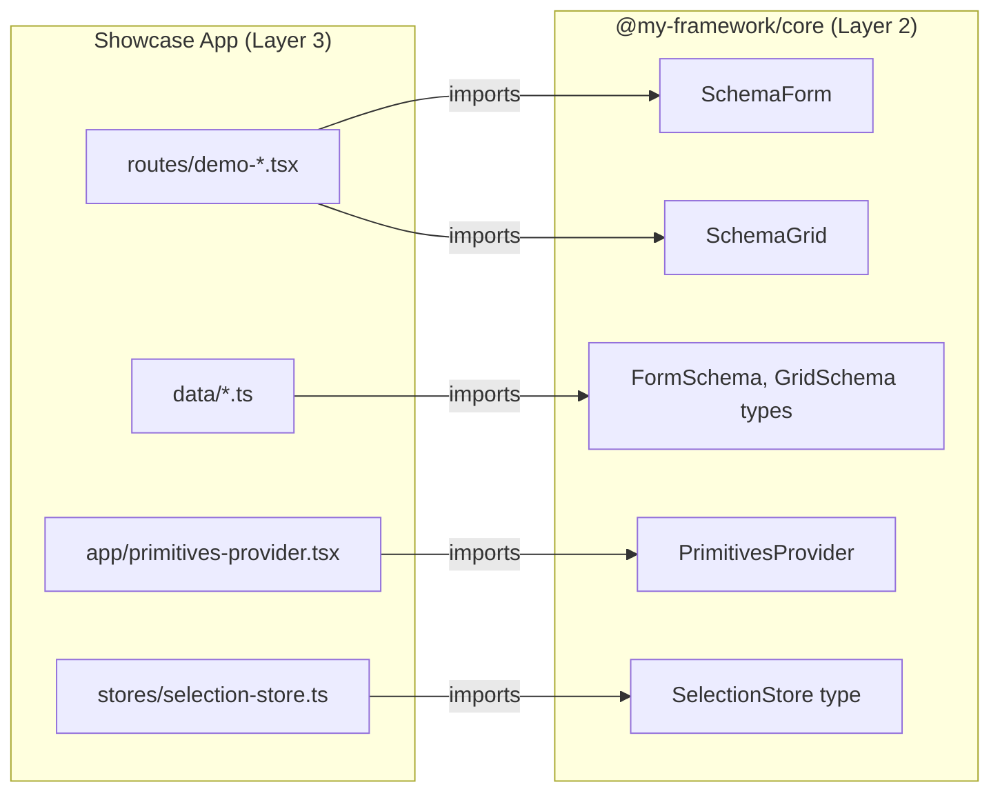

# Showcase App - Context Map

Layer 3: TanStack Start file-based routes and app-specific components. Imports Layer 2 (Engine) and Layer 1 (Primitives).

## File Inventory

### `routes/`

| File | Export Name | Export Type | Description |
|------|-------------|-------------|-------------|
| __root.tsx | *(route)* | component | Root layout route |
| index.tsx | *(route)* | component | Home page route |
| demo.tsx | *(route)* | component | Demo index route |
| demo-form.tsx | *(route)* | component | Contact form demo |
| demo-grid.tsx | *(route)* | component | Grid demo |
| demo-orders.tsx | *(route)* | component | Orders grid demo |
| demo-registration.tsx | *(route)* | component | Registration form demo |
| demo-support-ticket.tsx | *(route)* | component | Support ticket form demo |

### `data/`

| File | Export Name | Export Type | Description |
|------|-------------|-------------|-------------|
| index.ts | *(barrel)* | re-export | Re-exports all data files |
| contact-form-schema.ts | contactFormSchema | const | Contact form schema definition |
| user-grid-schema.ts | userGridSchema | const | User grid schema definition |
| order-grid-schema.ts | orderGridSchema | const | Order grid schema definition |
| registration-form-schema.ts | registrationFormSchema | const | Registration form schema definition |
| support-ticket-form-schema.ts | supportTicketFormSchema | const | Support ticket form schema definition |
| mock-users.ts | mockUsers | const | Mock user data array |
| mock-orders.ts | mockOrders | const | Mock order data array |
| user-row.ts | UserRow | type | User row type definition |
| order-row.ts | OrderRow | type | Order row type definition |
| primitive-mappings.tsx | primitives | const | Maps shadcn components to primitives |

### `server/`

| File | Export Name | Export Type | Description |
|------|-------------|-------------|-------------|
| get-contact-form-schema.ts | getContactFormSchema | const (serverFn) | Server function returning contact form schema |
| get-user-grid-schema.ts | getUserGridSchema | const (serverFn) | Server function returning user grid schema |
| get-order-grid-schema.ts | getOrderGridSchema | const (serverFn) | Server function returning order grid schema |
| get-registration-form-schema.ts | getRegistrationFormSchema | const (serverFn) | Server function returning registration form schema |
| get-support-ticket-form-schema.ts | getSupportTicketFormSchema | const (serverFn) | Server function returning support ticket form schema |
| get-users.ts | getUsers | const (serverFn) | Server function returning mock user data |
| get-orders.ts | getOrders | const (serverFn) | Server function returning mock order data |

### `stores/`

| File | Export Name | Export Type | Description |
|------|-------------|-------------|-------------|
| selection-store.ts | createSelectionStore | function | Zustand store factory for grid selection |

### `lib/`

| File | Export Name | Export Type | Description |
|------|-------------|-------------|-------------|
| utils.ts | cn | function | Tailwind CSS class merge utility |
| query-client.tsx | *(unknown)* | component/function | TanStack Query client provider |

### `app/`

| File | Export Name | Export Type | Description |
|------|-------------|-------------|-------------|
| entry-client.tsx | *(default)* | component | Client-side entry point |
| entry-server.tsx | *(default)* | component | Server-side entry point |
| primitives-provider.tsx | *(unknown)* | component | Wraps app with engine PrimitivesProvider |
| app.css | *(stylesheet)* | - | Global styles |

### `components/ui/`

| File | Export Name | Export Type | Description |
|------|-------------|-------------|-------------|
| badge.tsx | Badge | component | shadcn Badge |
| button.tsx | Button | component | shadcn Button |
| checkbox.tsx | Checkbox | component | shadcn Checkbox |
| dialog.tsx | Dialog, ... | component | shadcn Dialog |
| dropdown-menu.tsx | DropdownMenu, ... | component | shadcn DropdownMenu |
| input.tsx | Input | component | shadcn Input |
| label.tsx | Label | component | shadcn Label |
| select.tsx | Select, ... | component | shadcn Select |
| table.tsx | Table, ... | component | shadcn Table |
| textarea.tsx | Textarea | component | shadcn Textarea |

### Root (`src/`)

| File | Export Name | Export Type | Description |
|------|-------------|-------------|-------------|
| router.tsx | *(unknown)* | function/component | TanStack Router configuration |
| routeTree.gen.ts | FileRoutesByFullPath, FileRoutesByTo, FileRoutesById, FileRouteTypes, RootRouteChildren, routeTree | interface, const | Auto-generated route tree |

## Internal Relationships

```mermaid
graph TD
    subgraph "data/"
        CFS["contact-form-schema.ts"]
        UGS["user-grid-schema.ts"]
        OGS["order-grid-schema.ts"]
        RFS["registration-form-schema.ts"]
        STFS["support-ticket-form-schema.ts"]
        MU["mock-users.ts"]
        MO["mock-orders.ts"]
        IDX["index.ts"]
    end

    subgraph "server/"
        GCFS["get-contact-form-schema.ts"]
        GUGS["get-user-grid-schema.ts"]
        GOGS["get-order-grid-schema.ts"]
        GRFS["get-registration-form-schema.ts"]
        GSTFS["get-support-ticket-form-schema.ts"]
        GU["get-users.ts"]
        GO["get-orders.ts"]
    end

    subgraph "routes/"
        DF["demo-form.tsx"]
        DG["demo-grid.tsx"]
        DO["demo-orders.tsx"]
        DR["demo-registration.tsx"]
        DST["demo-support-ticket.tsx"]
    end

    IDX -->|re-exports| CFS
    IDX -->|re-exports| UGS
    IDX -->|re-exports| OGS
    IDX -->|re-exports| RFS
    IDX -->|re-exports| STFS
    IDX -->|re-exports| MU
    IDX -->|re-exports| MO

    GCFS -->|consumes| CFS
    GUGS -->|consumes| UGS
    GOGS -->|consumes| OGS
    GRFS -->|consumes| RFS
    GSTFS -->|consumes| STFS
    GU -->|consumes| MU
    GO -->|consumes| MO

    DF -->|consumes| GCFS
    DG -->|consumes| GUGS
    DG -->|consumes| GU
    DO -->|consumes| GOGS
    DO -->|consumes| GO
    DR -->|consumes| GRFS
    DST -->|consumes| GSTFS

    primitive-mappings.tsx -->|consumes| components/ui/
    primitives-provider.tsx -->|consumes| primitive-mappings.tsx
```

## External Dependencies

## Exemptions

- `routeTree.gen.ts` exports 6 symbols — exempt (auto-generated file)
- `components/ui/*.tsx` — exempt (shadcn copy-pasted files, maintained by shadcn CLI)