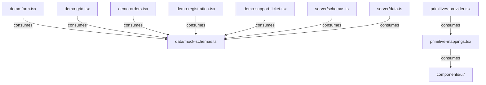
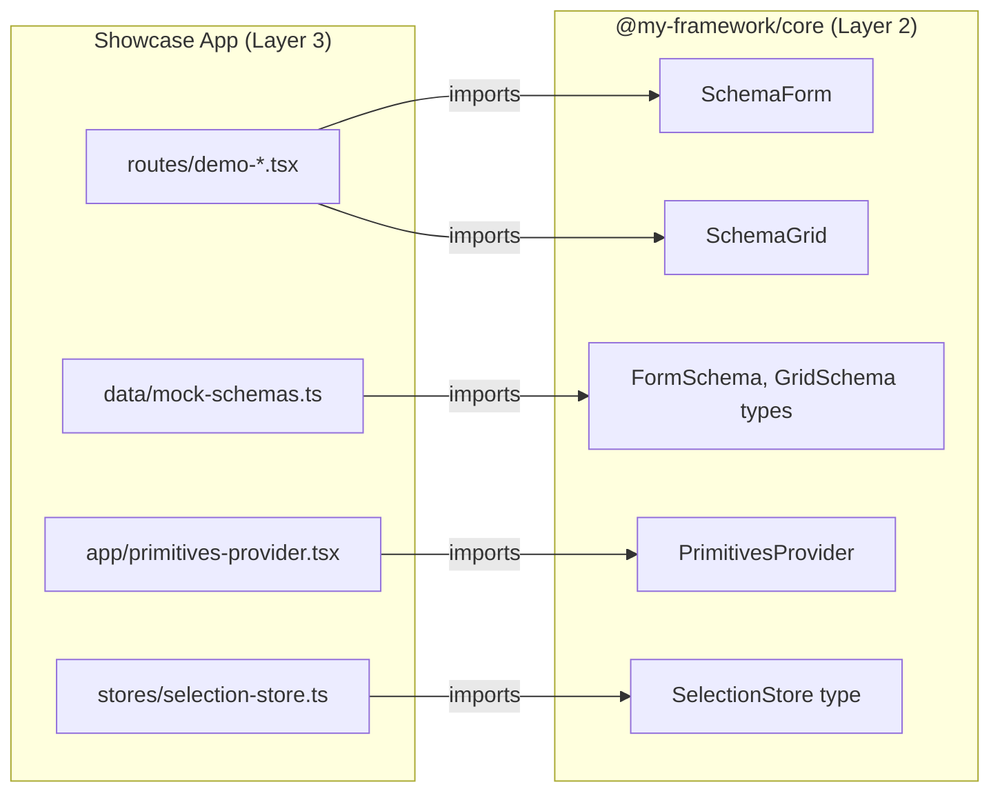

# Showcase App - Context Map

Layer 3: TanStack Start file-based routes and app-specific components. Imports Layer 2 (Engine) and Layer 1 (Primitives).

## File Inventory

### `routes/`

| File | Export Name | Export Type | Description |
|------|-------------|-------------|-------------|
| __root.tsx | *(route)* | component | Root layout route |
| index.tsx | *(route)* | component | Home page route |
| demo.tsx | *(route)* | component | Demo index route |
| demo-form.tsx | *(route)* | component | Contact form demo |
| demo-grid.tsx | *(route)* | component | Grid demo |
| demo-orders.tsx | *(route)* | component | Orders grid demo |
| demo-registration.tsx | *(route)* | component | Registration form demo |
| demo-support-ticket.tsx | *(route)* | component | Support ticket form demo |

### `data/`

| File | Export Name | Export Type | Description |
|------|-------------|-------------|-------------|
| mock-schemas.ts | contactFormSchema, userGridSchema, mockUsers, orderGridSchema, mockOrders, registrationFormSchema, supportTicketFormSchema | const | Mock schema definitions and test data |
| primitive-mappings.tsx | *(unknown)* | component/function | Maps shadcn components to primitives |

### `server/`

| File | Export Name | Export Type | Description |
|------|-------------|-------------|-------------|
| schemas.ts | getContactFormSchema, getUserGridSchema, getOrderGridSchema, getRegistrationFormSchema, getSupportTicketFormSchema | const (serverFn) | Server functions returning schema JSON |
| data.ts | getUsers, getOrders | const (serverFn) | Server functions returning mock data |

### `stores/`

| File | Export Name | Export Type | Description |
|------|-------------|-------------|-------------|
| selection-store.ts | createSelectionStore | function | Zustand store factory for grid selection |

### `lib/`

| File | Export Name | Export Type | Description |
|------|-------------|-------------|-------------|
| utils.ts | cn | function | Tailwind CSS class merge utility |
| query-client.tsx | *(unknown)* | component/function | TanStack Query client provider |

### `app/`

| File | Export Name | Export Type | Description |
|------|-------------|-------------|-------------|
| entry-client.tsx | *(default)* | component | Client-side entry point |
| entry-server.tsx | *(default)* | component | Server-side entry point |
| primitives-provider.tsx | *(unknown)* | component | Wraps app with engine PrimitivesProvider |
| app.css | *(stylesheet)* | - | Global styles |

### `components/ui/`

| File | Export Name | Export Type | Description |
|------|-------------|-------------|-------------|
| badge.tsx | Badge | component | shadcn Badge |
| button.tsx | Button | component | shadcn Button |
| checkbox.tsx | Checkbox | component | shadcn Checkbox |
| dialog.tsx | Dialog, ... | component | shadcn Dialog |
| dropdown-menu.tsx | DropdownMenu, ... | component | shadcn DropdownMenu |
| input.tsx | Input | component | shadcn Input |
| label.tsx | Label | component | shadcn Label |
| select.tsx | Select, ... | component | shadcn Select |
| table.tsx | Table, ... | component | shadcn Table |
| textarea.tsx | Textarea | component | shadcn Textarea |

### Root (`src/`)

| File | Export Name | Export Type | Description |
|------|-------------|-------------|-------------|
| router.tsx | *(unknown)* | function/component | TanStack Router configuration |
| routeTree.gen.ts | FileRoutesByFullPath, FileRoutesByTo, FileRoutesById, FileRouteTypes, RootRouteChildren, routeTree | interface, const | Auto-generated route tree |

## Internal Relationships

## External Dependencies

## Violations (Pre-Rule)

- `mock-schemas.ts` exports 7 constants - should be split into individual files
- `server/schemas.ts` exports 5 server functions - should be split into individual files
- `server/data.ts` exports 2 server functions - should be split into individual files
- `routeTree.gen.ts` exports 6 symbols - exempt (auto-generated file)
- `components/ui/*.tsx` - exempt (shadcn copy-pasted files, maintained by shadcn CLI)