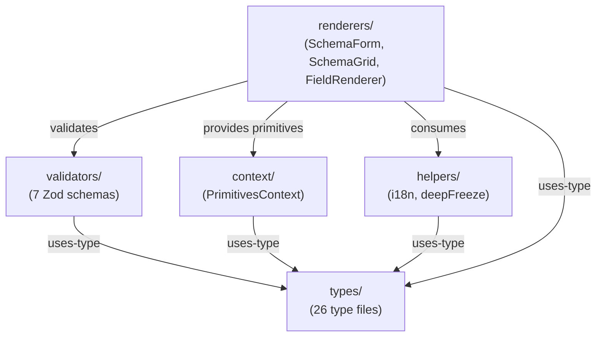
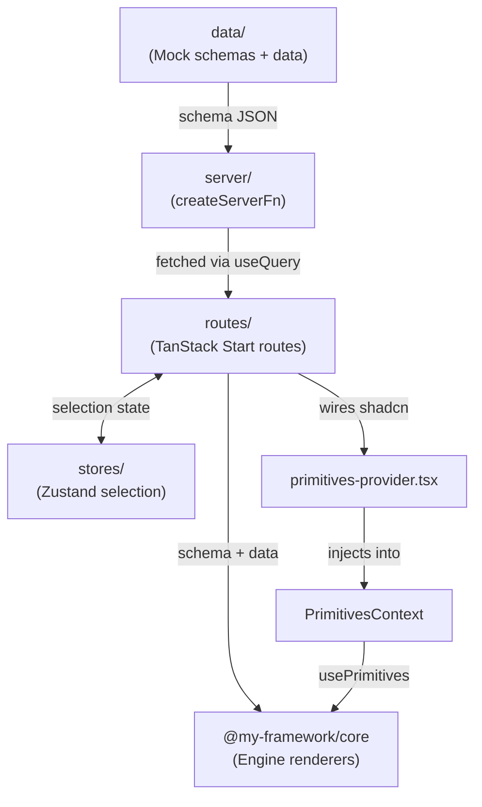
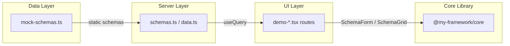

# Project Context Map

## Layer 1: Primitives (`packages/core/src/primitives/`)

| Directory | Purpose | Dependencies |
|-----------|---------|--------------|
| primitives/ | Generic UI wrappers (StatusBadge, AddressInput, FileUpload) | React only |

## Layer 2: Engine (`packages/core/src/engine/`)

| Directory | Purpose | Imports From | Imported By |
|-----------|---------|--------------|-------------|
| types/ | Schema type definitions (26 types, one per file) | (none — pure TS types) | validators/, context/, helpers/, renderers/ |
| validators/ | Zod schemas + runtime validation (7 files) | types/, zod | renderers/, index.ts |
| context/ | PrimitivesContext provider | types/ | renderers/ |
| helpers/ | i18n resolveMessage, deepFreeze immutability | types/ | renderers/ |
| renderers/ | SchemaForm, SchemaGrid, FieldRenderer, ThemeProvider | types/, validators/, context/, helpers/ | index.ts |

### Cross-Layer Dependency Graph

## Layer 3: Composition (`apps/showcase/`)

| Directory | Purpose | Imports From |
|-----------|---------|--------------|
| routes/ | TanStack Start file-based routes | @my-framework/core, server/, stores/ |
| server/ | Mock server functions (createServerFn) | data/ |
| data/ | Immutable schemas, typed mock data (UserRow, OrderRow), primitive mappings | @my-framework/core |
| stores/ | Zustand selection stores | (none) |
| app/components/ | shadcn/ui components | (shadcn) |
| app/primitives-provider.tsx | Wires shadcn → PrimitivesContext | @my-framework/core |

### Data Flow

### Layer 3 Showcase Data Flow

## Key Files

| File | Role |
|------|------|
| `packages/core/src/index.ts` | Public API — re-exports from primitives/ and engine/ |
| `packages/core/src/engine/index.ts` | Engine barrel — re-exports types, validators, context, helpers, renderers |
| `packages/core/src/engine/types/index.ts` | Types barrel — re-exports all 26 type files |
| `packages/core/src/engine/validators/index.ts` | Validators barrel — re-exports all 7 validator files |
| `packages/core/src/engine/helpers/deep-freeze.ts` | Runtime immutability — recursively freezes objects |
| `packages/core/src/engine/types/branded.ts` | Branded types for FieldId, DataKey |
| `packages/core/src/engine/types/readonly-deep.ts` | Recursive ReadonlyDeep<T> wrapper |
