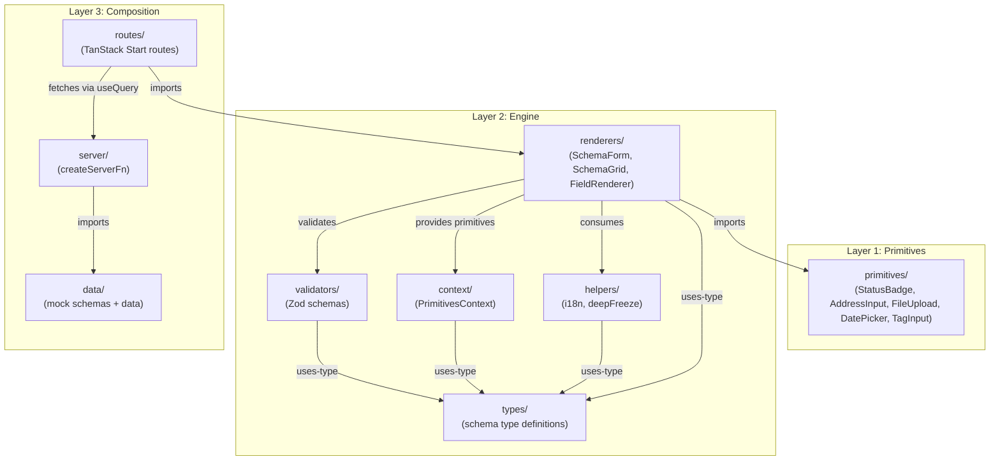

# Project Context Map

> **Note:** Per-directory context is now stored in `.context.json` files alongside source code.
> See `docs/ai/system.md` for the compressed AI entry point.

## Cross-Layer Dependency Graph


```mermaid
graph TD
    subgraph "Layer 1: Primitives"
        primitives["primitives/<br/>(StatusBadge, AddressInput, FileUpload, DatePicker, TagInput)"]
    end

    subgraph "Layer 2: Engine"
        types["types/<br/>(schema type definitions)"]
        validators["validators/<br/>(Zod schemas)"]
        context["context/<br/>(PrimitivesContext)"]
        helpers["helpers/<br/>(i18n, deepFreeze)"]
        renderers["renderers/<br/>(SchemaForm, SchemaGrid, FieldRenderer)"]
    end

    subgraph "Layer 3: Composition"
        routes["routes/<br/>(TanStack Start routes)"]
        server["server/<br/>(createServerFn)"]
        data["data/<br/>(mock schemas + data)"]
    end

    validators -->|uses-type| types
    context -->|uses-type| types
    helpers -->|uses-type| types
    renderers -->|uses-type| types
    renderers -->|validates| validators
    renderers -->|provides primitives| context
    renderers -->|consumes| helpers
    renderers -->|imports| primitives
    routes -->|imports| renderers
    server -->|imports| data
    routes -->|fetches via useQuery| server
```

## Key Barrel Files

| File | Role |
|------|------|
| `packages/core/src/index.ts` | Public API — re-exports from primitives/ and engine/ |
| `packages/core/src/engine/index.ts` | Engine barrel — re-exports all subdirectories |
| `packages/core/src/engine/types/index.ts` | Types barrel — re-exports all type definition files |
| `packages/core/src/engine/validators/index.ts` | Validators barrel — re-exports all validator files |

## Data Flow

```mermaid
graph LR
    data["data/"] -->|schema JSON| server["server/"]
    server -->|useQuery| routes["routes/"]
    routes -->|SchemaForm/SchemaGrid| renderers["@my-framework/core"]