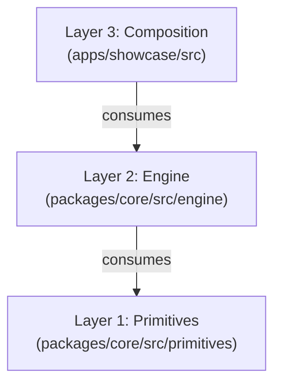
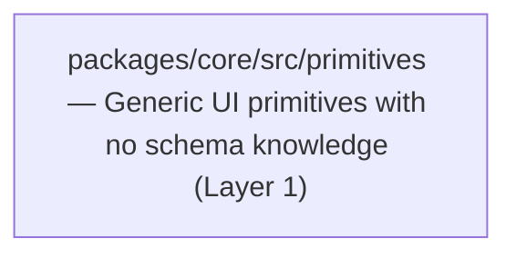
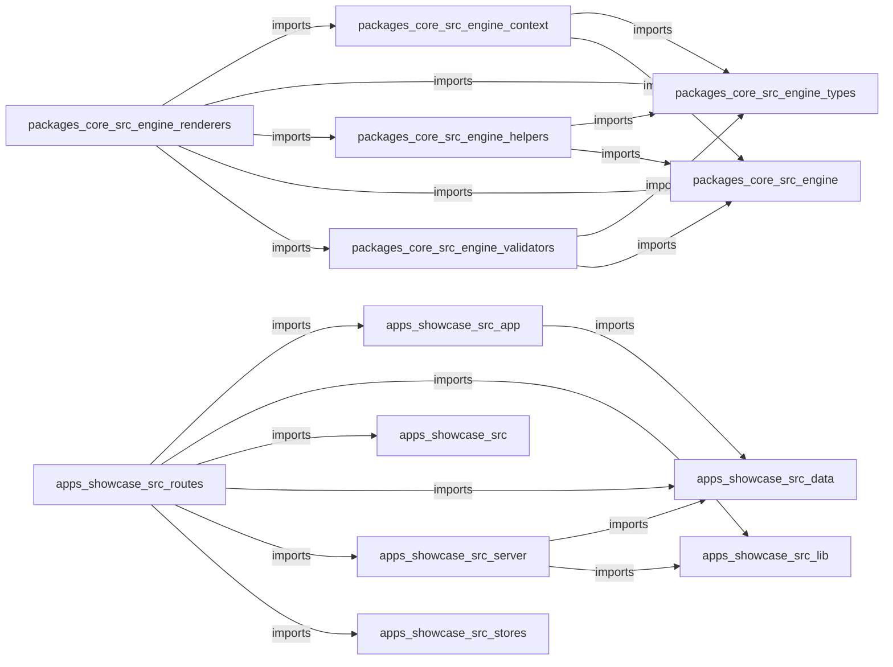

# Context Map

> NOTE: This file is auto-generated by `scripts/generate-ai-context/`. Do not edit manually.
> Run `pnpm generate-context` to regenerate.

## Layer Dependency Graph

```mermaid
graph TD
    L1["Layer 1: Primitives<br/>(packages/core/src/primitives)"]
    L2["Layer 2: Engine<br/>(packages/core/src/engine)"]
    L3["Layer 3: Composition<br/>(apps/showcase/src)"]
    L3 -->|consumes| L2
    L2 -->|consumes| L1
```

## Layer 1: Primitives

**Root:** `packages/core/src/primitives`
**Directories:** 1

```mermaid
graph TD
    packages_core_src_primitives["packages/core/src/primitives — Generic UI primitives with no schema knowledge (Layer 1)"]
```

| Directory | Purpose | Files |
|-----------|---------|-------|
| `packages/core/src/primitives` | Generic UI primitives with no schema knowledge (Layer 1) | 10 |

## Layer 2: Engine

**Root:** `packages/core/src/engine`
**Directories:** 6

```mermaid
graph TD
    packages_core_src_engine["packages/core/src/engine — Schema parsing, validation, and rendering engine (Layer 2)"]
    packages_core_src_engine_context["packages/core/src/engine/context — React context providers for dependency injection"]
    packages_core_src_engine_helpers["packages/core/src/engine/helpers — Pure utility functions for schema processing and rendering"]
    packages_core_src_engine_renderers["packages/core/src/engine/renderers — Schema-driven layout renderers for form, grid, wizard, ta..."]
    packages_core_src_engine_types["packages/core/src/engine/types — Type definitions for schema-driven forms, grids, layouts,..."]
    packages_core_src_engine_validators["packages/core/src/engine/validators — Zod validators for all schema types with structured error..."]
```

| Directory | Purpose | Files |
|-----------|---------|-------|
| `packages/core/src/engine` | Schema parsing, validation, and rendering engine (Layer 2) | 1 |
| `packages/core/src/engine/context` | React context providers for dependency injection | 3 |
| `packages/core/src/engine/helpers` | Pure utility functions for schema processing and rendering | 9 |
| `packages/core/src/engine/renderers` | Schema-driven layout renderers for form, grid, wizard, tabs, and layout compo... | 19 |
| `packages/core/src/engine/types` | Type definitions for schema-driven forms, grids, layouts, wizards, and tabs | 57 |
| `packages/core/src/engine/validators` | Zod validators for all schema types with structured error reporting | 17 |

## Layer 3: Composition

**Root:** `apps/showcase/src`
**Directories:** 9

```mermaid
graph TD
    apps_showcase_src["apps/showcase/src — Showcase application demonstrating schema framework usage"]
    apps_showcase_src_app["apps/showcase/src/app — Root app layout and global providers"]
    apps_showcase_src_components["apps/showcase/src/components — Shared UI components for the showcase app"]
    apps_showcase_src_components_ui["apps/showcase/src/components/ui — Reusable UI components built on schema primitives"]
    apps_showcase_src_data["apps/showcase/src/data — Showcase demo schemas, mock data, and primitive component..."]
    apps_showcase_src_lib["apps/showcase/src/lib — Shared utilities and provider configurations"]
    apps_showcase_src_routes["apps/showcase/src/routes — TanStack Start file-based routes for all showcase demo pages"]
    apps_showcase_src_server["apps/showcase/src/server — Server-side API route handlers"]
    apps_showcase_src_stores["apps/showcase/src/stores — Client-side state management stores"]
```

| Directory | Purpose | Files |
|-----------|---------|-------|
| `apps/showcase/src` | Showcase application demonstrating schema framework usage | 2 |
| `apps/showcase/src/app` | Root app layout and global providers | 3 |
| `apps/showcase/src/components` | Shared UI components for the showcase app | 1 |
| `apps/showcase/src/components/ui` | Reusable UI components built on schema primitives | 17 |
| `apps/showcase/src/data` | Showcase demo schemas, mock data, and primitive component mappings | 19 |
| `apps/showcase/src/lib` | Shared utilities and provider configurations | 4 |
| `apps/showcase/src/routes` | TanStack Start file-based routes for all showcase demo pages | 18 |
| `apps/showcase/src/server` | Server-side API route handlers | 12 |
| `apps/showcase/src/stores` | Client-side state management stores | 1 |

## Cross-Layer Dependencies

```mermaid
graph LR
    packages_core_src_engine_context -->|imports| packages_core_src_engine_types
    packages_core_src_engine_context -->|imports| packages_core_src_engine
    packages_core_src_engine_helpers -->|imports| packages_core_src_engine_types
    packages_core_src_engine_helpers -->|imports| packages_core_src_engine
    packages_core_src_engine_renderers -->|imports| packages_core_src_engine_context
    packages_core_src_engine_renderers -->|imports| packages_core_src_engine_types
    packages_core_src_engine_renderers -->|imports| packages_core_src_engine_helpers
    packages_core_src_engine_renderers -->|imports| packages_core_src_engine
    packages_core_src_engine_renderers -->|imports| packages_core_src_engine_validators
    packages_core_src_engine_validators -->|imports| packages_core_src_engine_types
    packages_core_src_engine_validators -->|imports| packages_core_src_engine
    apps_showcase_src_app -->|imports| apps_showcase_src_data
    apps_showcase_src_routes -->|imports| apps_showcase_src_app
    apps_showcase_src_routes -->|imports| apps_showcase_src_lib
    apps_showcase_src_routes -->|imports| apps_showcase_src
    apps_showcase_src_routes -->|imports| apps_showcase_src_data
    apps_showcase_src_routes -->|imports| apps_showcase_src_server
    apps_showcase_src_routes -->|imports| apps_showcase_src_stores
    apps_showcase_src_server -->|imports| apps_showcase_src_data
    apps_showcase_src_server -->|imports| apps_showcase_src_lib
```
