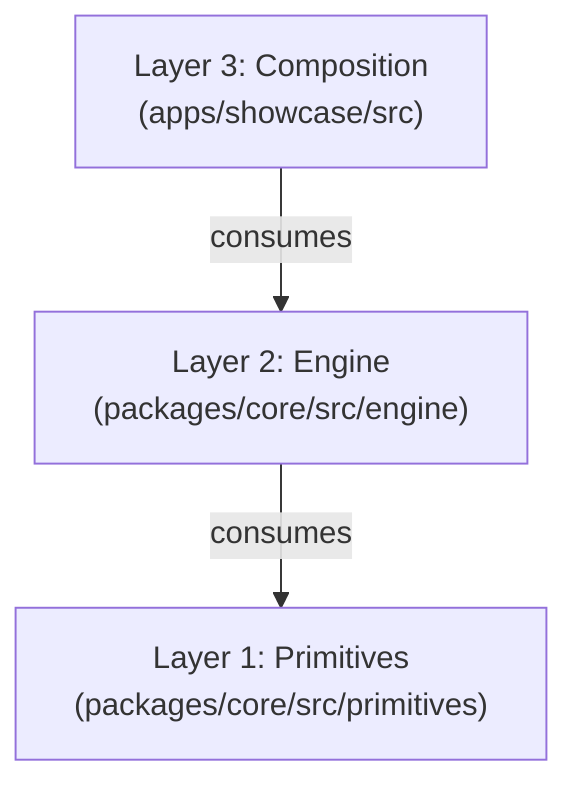
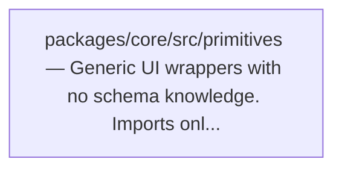

# Context Map

> NOTE: This file is auto-generated by `scripts/generate-ai-context/`. Do not edit manually.
> Run `pnpm generate-context` to regenerate.

## Layer Dependency Graph

```mermaid
graph TD
    L1["Layer 1: Primitives<br/>(packages/core/src/primitives)"]
    L2["Layer 2: Engine<br/>(packages/core/src/engine)"]
    L3["Layer 3: Composition<br/>(apps/showcase/src)"]
    L3 -->|consumes| L2
    L2 -->|consumes| L1
```

## Layer 1: Primitives

**Root:** `packages/core/src/primitives`
**Directories:** 1

```mermaid
graph TD
    packages_core_src_primitives["packages/core/src/primitives — Generic UI wrappers with no schema knowledge. Imports onl..."]
```

| Directory | Purpose | Files |
|-----------|---------|-------|
| `packages/core/src/primitives` | Generic UI wrappers with no schema knowledge. Imports only React. | 10 |

## Layer 2: Engine

**Root:** `packages/core/src/engine`
**Directories:** 6

```mermaid
graph TD
    packages_core_src_engine["packages/core/src/engine — Schema parsing, validation, and rendering. Imports Layer ..."]
    packages_core_src_engine_context["packages/core/src/engine/context — React context for injecting shadcn primitives into engine..."]
    packages_core_src_engine_helpers["packages/core/src/engine/helpers — Utility functions: i18n, immutability, branded type helpers."]
    packages_core_src_engine_renderers["packages/core/src/engine/renderers — React renderers that consume schemas via PrimitivesContext."]
    packages_core_src_engine_types["packages/core/src/engine/types — All schema type definitions (one per file). Pure TS, no r..."]
    packages_core_src_engine_validators["packages/core/src/engine/validators — Zod schemas and runtime validation functions."]
```

| Directory | Purpose | Files |
|-----------|---------|-------|
| `packages/core/src/engine` | Schema parsing, validation, and rendering. Imports Layer 1 only. | 1 |
| `packages/core/src/engine/context` | React context for injecting shadcn primitives into engine renderers. | 3 |
| `packages/core/src/engine/helpers` | Utility functions: i18n, immutability, branded type helpers. | 8 |
| `packages/core/src/engine/renderers` | React renderers that consume schemas via PrimitivesContext. | 12 |
| `packages/core/src/engine/types` | All schema type definitions (one per file). Pure TS, no runtime deps. | 50 |
| `packages/core/src/engine/validators` | Zod schemas and runtime validation functions. | 13 |

## Layer 3: Composition

**Root:** `apps/showcase/src`
**Directories:** 8

```mermaid
graph TD
    apps_showcase_src["apps/showcase/src — Showcase app entry point. TanStack Start file-based routing."]
    apps_showcase_src_app["apps/showcase/src/app — App-level providers (primitives context, query client, th..."]
    apps_showcase_src_components_ui["apps/showcase/src/components/ui"]
    apps_showcase_src_data["apps/showcase/src/data — Mock schema definitions and static data for showcase demos"]
    apps_showcase_src_lib["apps/showcase/src/lib — Shared utility functions (cn helper, serialization)"]
    apps_showcase_src_routes["apps/showcase/src/routes — TanStack Start file-based routes for showcase app pages a..."]
    apps_showcase_src_server["apps/showcase/src/server — Server functions for data fetching (TanStack Start create..."]
    apps_showcase_src_stores["apps/showcase/src/stores — Zustand state stores for demo data (users, orders, form s..."]
```

| Directory | Purpose | Files |
|-----------|---------|-------|
| `apps/showcase/src` | Showcase app entry point. TanStack Start file-based routing. | 1 |
| `apps/showcase/src/app` | App-level providers (primitives context, query client, theme) | 3 |
| `apps/showcase/src/components/ui` | — | 17 |
| `apps/showcase/src/data` | Mock schema definitions and static data for showcase demos | 17 |
| `apps/showcase/src/lib` | Shared utility functions (cn helper, serialization) | 4 |
| `apps/showcase/src/routes` | TanStack Start file-based routes for showcase app pages and demos | 13 |
| `apps/showcase/src/server` | Server functions for data fetching (TanStack Start createServerFn). | 12 |
| `apps/showcase/src/stores` | Zustand state stores for demo data (users, orders, form schemas) | 1 |

## Cross-Layer Dependencies

```mermaid
graph LR
    packages_core_src_engine_context -->|imports| packages_core_src_engine_types
    packages_core_src_engine_context -->|imports| packages_core_src_engine
    packages_core_src_engine_context -->|imports| packages_core_src_engine
    packages_core_src_engine_helpers -->|imports| packages_core_src_engine_types
    packages_core_src_engine_helpers -->|imports| packages_core_src_engine_types
    packages_core_src_engine_helpers -->|imports| packages_core_src_engine_types
    packages_core_src_engine_helpers -->|imports| packages_core_src_engine_types
    packages_core_src_engine_helpers -->|imports| packages_core_src_engine_types
    packages_core_src_engine_helpers -->|imports| packages_core_src_engine_types
    packages_core_src_engine_helpers -->|imports| packages_core_src_engine_types
    packages_core_src_engine_helpers -->|imports| packages_core_src_engine_types
    packages_core_src_engine_helpers -->|imports| packages_core_src_engine_types
    packages_core_src_engine_helpers -->|imports| packages_core_src_engine
    packages_core_src_engine_helpers -->|imports| packages_core_src_engine
    packages_core_src_engine_helpers -->|imports| packages_core_src_engine
    packages_core_src_engine_renderers -->|imports| packages_core_src_engine
    packages_core_src_engine_renderers -->|imports| packages_core_src_primitives
    packages_core_src_engine_renderers -->|imports| packages_core_src_engine_context
    packages_core_src_engine_renderers -->|imports| packages_core_src_engine_helpers
    packages_core_src_engine_renderers -->|imports| packages_core_src_engine
    packages_core_src_engine_renderers -->|imports| packages_core_src_engine_context
    packages_core_src_engine_renderers -->|imports| packages_core_src_engine
    packages_core_src_engine_renderers -->|imports| packages_core_src_engine_context
    packages_core_src_engine_renderers -->|imports| packages_core_src_engine_helpers
    packages_core_src_engine_renderers -->|imports| packages_core_src_engine
    packages_core_src_engine_renderers -->|imports| packages_core_src_engine_context
    packages_core_src_engine_renderers -->|imports| packages_core_src_engine_helpers
    packages_core_src_engine_renderers -->|imports| packages_core_src_engine
    packages_core_src_engine_renderers -->|imports| packages_core_src_engine
    packages_core_src_engine_renderers -->|imports| packages_core_src_engine_context
    packages_core_src_engine_renderers -->|imports| packages_core_src_engine_helpers
    packages_core_src_engine_renderers -->|imports| packages_core_src_engine_helpers
    packages_core_src_engine_renderers -->|imports| packages_core_src_engine
    packages_core_src_engine_renderers -->|imports| packages_core_src_engine_context
    packages_core_src_engine_renderers -->|imports| packages_core_src_engine_helpers
    packages_core_src_engine_renderers -->|imports| packages_core_src_engine
    packages_core_src_engine_renderers -->|imports| packages_core_src_engine
    packages_core_src_engine_renderers -->|imports| packages_core_src_engine_helpers
    packages_core_src_engine_renderers -->|imports| packages_core_src_engine_context
    packages_core_src_engine_renderers -->|imports| packages_core_src_engine_helpers
    packages_core_src_engine_renderers -->|imports| packages_core_src_engine
    packages_core_src_engine_renderers -->|imports| packages_core_src_engine
    packages_core_src_engine_renderers -->|imports| packages_core_src_engine
    packages_core_src_engine_renderers -->|imports| packages_core_src_engine
    packages_core_src_engine_renderers -->|imports| packages_core_src_engine_helpers
    packages_core_src_engine_renderers -->|imports| packages_core_src_engine_context
    packages_core_src_engine_validators -->|imports| packages_core_src_engine
    packages_core_src_engine_validators -->|imports| packages_core_src_engine
    packages_core_src_engine_validators -->|imports| packages_core_src_engine_types
    apps_showcase_src_app -->|imports| apps_showcase_src_data
    apps_showcase_src_routes -->|imports| apps_showcase_src_app
    apps_showcase_src_routes -->|imports| apps_showcase_src_lib
    apps_showcase_src_routes -->|imports| apps_showcase_src_server
    apps_showcase_src_routes -->|imports| apps_showcase_src_data
    apps_showcase_src_routes -->|imports| apps_showcase_src_server
    apps_showcase_src_routes -->|imports| apps_showcase_src_server
    apps_showcase_src_routes -->|imports| apps_showcase_src_server
    apps_showcase_src_routes -->|imports| apps_showcase_src_server
    apps_showcase_src_routes -->|imports| apps_showcase_src_stores
    apps_showcase_src_routes -->|imports| apps_showcase_src_data
    apps_showcase_src_routes -->|imports| apps_showcase_src_server
    apps_showcase_src_routes -->|imports| apps_showcase_src_server
    apps_showcase_src_routes -->|imports| apps_showcase_src_server
    apps_showcase_src_routes -->|imports| apps_showcase_src_server
    apps_showcase_src_routes -->|imports| apps_showcase_src_server
    apps_showcase_src_routes -->|imports| apps_showcase_src_server
    apps_showcase_src_routes -->|imports| apps_showcase_src_server
    apps_showcase_src_server -->|imports| apps_showcase_src_lib
    apps_showcase_src_server -->|imports| apps_showcase_src_data
    apps_showcase_src_server -->|imports| apps_showcase_src_lib
    apps_showcase_src_server -->|imports| apps_showcase_src_data
    apps_showcase_src_server -->|imports| apps_showcase_src_lib
    apps_showcase_src_server -->|imports| apps_showcase_src_data
    apps_showcase_src_server -->|imports| apps_showcase_src_lib
    apps_showcase_src_server -->|imports| apps_showcase_src_data
    apps_showcase_src_server -->|imports| apps_showcase_src_lib
    apps_showcase_src_server -->|imports| apps_showcase_src_data
    apps_showcase_src_server -->|imports| apps_showcase_src_lib
    apps_showcase_src_server -->|imports| apps_showcase_src_data
    apps_showcase_src_server -->|imports| apps_showcase_src_lib
    apps_showcase_src_server -->|imports| apps_showcase_src_data
    apps_showcase_src_server -->|imports| apps_showcase_src_lib
    apps_showcase_src_server -->|imports| apps_showcase_src_data
    apps_showcase_src_server -->|imports| apps_showcase_src_lib
    apps_showcase_src_server -->|imports| apps_showcase_src_data
    apps_showcase_src_server -->|imports| apps_showcase_src_lib
    apps_showcase_src_server -->|imports| apps_showcase_src_data
    apps_showcase_src_server -->|imports| apps_showcase_src_lib
    apps_showcase_src_server -->|imports| apps_showcase_src_lib
    apps_showcase_src_server -->|imports| apps_showcase_src_data
    apps_showcase_src_server -->|imports| apps_showcase_src_lib
    apps_showcase_src_server -->|imports| apps_showcase_src_data
```
