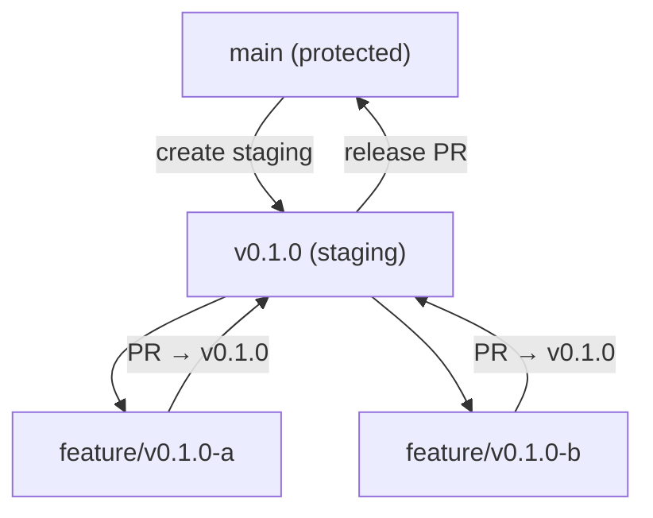

# ADR-004: Version Branch Strategy (Staging Branches)

## Status

Accepted

## Context

We need a branching strategy that keeps the `main` branch clean and stable during milestone development. Each milestone (e.g., v0.1.0) involves multiple feature branches, PRs, and iterations. Without a staging layer, feature branches would merge directly into `main`, making it impossible to isolate milestone work or roll back an incomplete milestone.

Two approaches were considered:

1. **Sequential feature branches to main** — Each feature branch PRs directly into `main`. Simple but pollutes `main` with in-progress work.
2. **Long-running version staging branches** — Each milestone gets a staging branch (e.g., `v0.1.0`). Feature branches PR into the staging branch. Staging merges into `main` only when the milestone is complete.

## Decision

We adopt **long-running version staging branches** (Option 2).

Each milestone gets a staging branch named `v{VERSION}` (e.g., `v0.1.0`, `v0.2.0`) created from `main`. All feature branches for that milestone:

- MUST be based on the staging branch (not `main`)
- MUST submit PRs targeting the staging branch as base

The staging branch merges into `main` via a release PR only when the milestone is complete.

### Branch Lifecycle

### Rules

- Feature branches MUST be created from the current milestone's staging branch
- PRs from feature branches MUST target the staging branch
- The staging branch MUST be kept up-to-date with `main` by merging `main` into it before creating new feature branches
- The staging branch merges into `main` only when the milestone is complete
- Direct commits to `main` are forbidden

## Consequences

**Positive:**
- `main` stays clean and always represents a stable release point
- Milestone scope is isolated — easy to see what belongs to which milestone
- An incomplete milestone can be abandoned without polluting `main`
- Changeset version bumps happen at milestone boundaries, not per-feature
- Supports the milestone completion workflow (Workflow H)

**Negative:**
- One extra branch to manage per milestone
- Feature branch commands must specify the staging branch explicitly
- Slightly more complex git workflow compared to direct-to-main