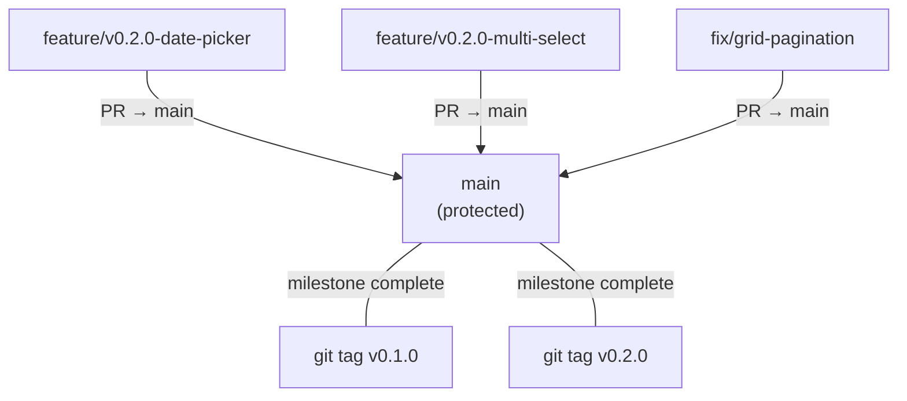
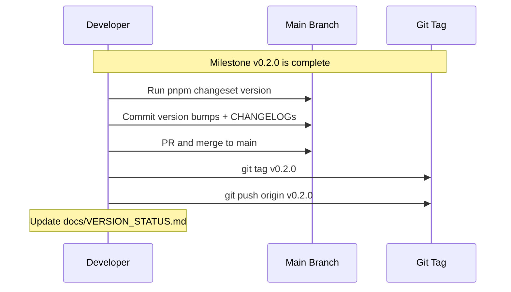
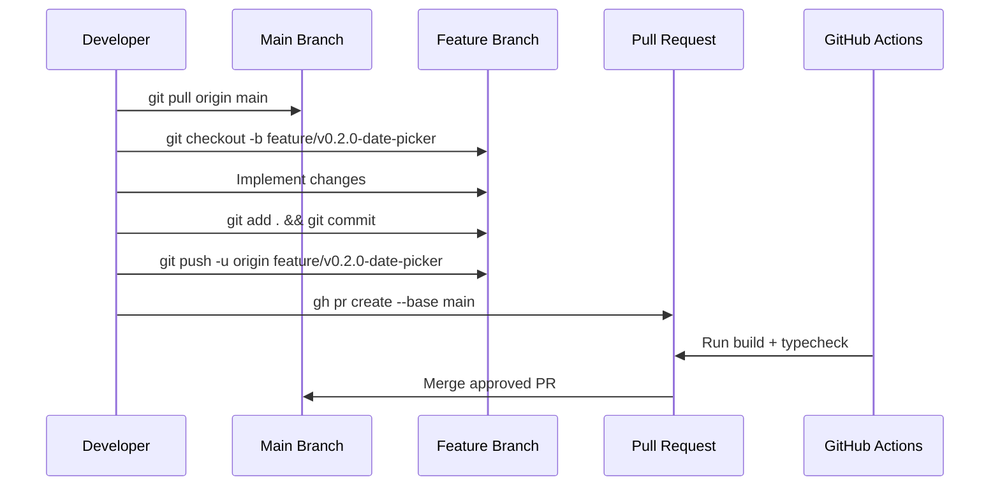

# ADR-005: Versioned GitHub Flow

## Status

Accepted

## Context

ADR-004 established long-running staging branches (e.g., `v0.1.0`) as an integration layer between feature branches and `main`. After completing milestone v0.1.0, the overhead of this approach became clear for a solo developer project without CI/CD deployment pipelines:

1. **Two merge hops per change** — feature → staging → main (instead of feature → main)
2. **Staging drift management** — staging branches must be kept up-to-date with `main` by merging `main` into them before creating new feature branches
3. **Per-branch protection rules** — each staging branch needs manual branch protection setup via `gh` CLI
4. **Complex git command sequences** — developers must remember staging-specific branch targets, merge directions, and protection commands
5. **No parallel milestones** — the project is solo-developed with strictly sequential milestones, so the isolation benefit of staging branches is never realized

Since only one milestone is active at a time and there is no deployment pipeline that needs a stable `main` at all times, the staging layer adds process overhead without compensating value.

## Decision

We adopt **Versioned GitHub Flow** — a simplified branching model where feature branches PR directly to `main`, and milestones are marked with git tags instead of staging branch merges.

### Model

### Rules

- Feature branches MUST be based on `main`
- Pull Requests from feature branches MUST target `main` as base
- Direct commits to `main` are forbidden
- When a milestone is complete, tag `main` with `v{VERSION}` (e.g., `git tag v0.2.0`)
- Only one milestone is active at a time (sequential milestones)
- Branch naming convention is unchanged: `feature/v{VERSION}-{description}`, `fix/{description}`, `docs/{description}`

### Milestone Completion Flow

### Typical Development Flow

## Consequences

**Positive:**
- Simpler git workflow — one merge hop instead of two
- No staging branch drift to manage
- No per-milestone branch protection setup required
- `main` always reflects the latest completed work
- Git tags provide clean milestone boundaries for history
- Reduces cognitive overhead for a solo developer

**Negative:**
- `main` contains in-progress work between feature merges (acceptable for a pre-1.0 solo project)
- Cannot abandon an incomplete milestone without reverting individual commits (mitigated by sequential milestones)
- Less isolation between milestones compared to staging branches (acceptable given solo development)

**Supersedes:** ADR-004 (Version Branch Strategy — Staging Branches)