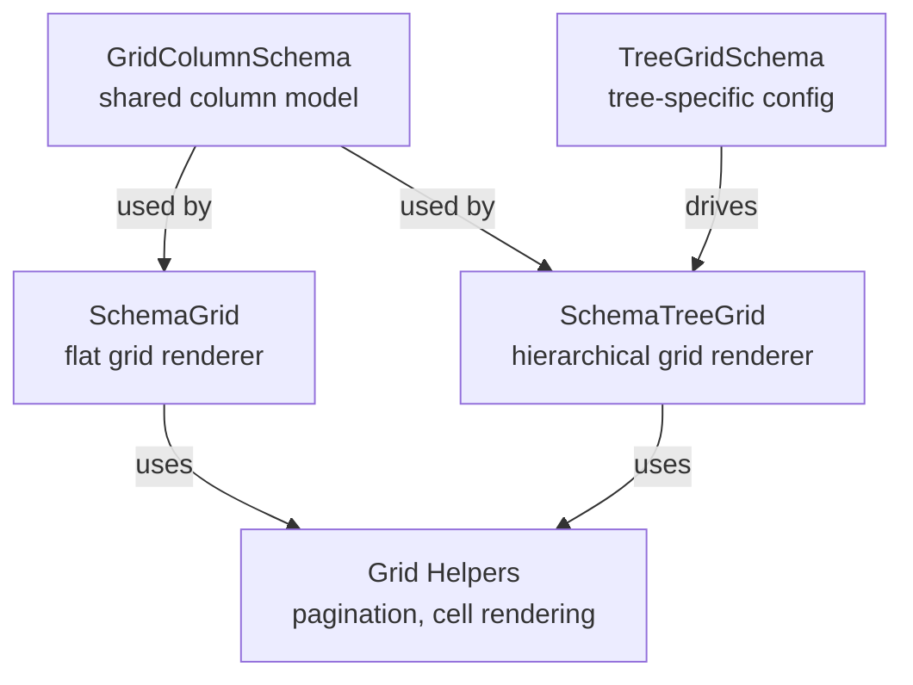

# ADR-008: Data Components Architecture (Tree, Chart, TreeGrid, Real-time)

## Status

Accepted

## Context

The project needs schema-driven data visualization components — Tree, Chart, and TreeGrid — with real-time polling patterns. These are the defining features of v0.4.x. Each component must integrate seamlessly with the existing ContentSchema system so they work inside any layout region (border panels, accordion items, dashboard panels, tabs).

Key design questions:

1. **How do Tree, Chart, and TreeGrid integrate with ContentSchema?**
2. **How does TreeGrid reuse GridColumnSchema without duplicating SchemaGrid logic?**
3. **How do we handle chart library dependencies without forcing all consumers to bundle chart code?**
4. **What is the scope of "real-time" in v0.4?**
5. **How do context menus work across tree and grid components?**

## Decision

### 1. ContentSchema Extension — Three New Variants

Add `tree`, `chart`, and `treeGrid` variants to the existing `ContentSchema` discriminated union:

```typescript
export type ContentSchema =
  | { readonly type: 'form'; readonly schema: FormSchema }
  | { readonly type: 'grid'; readonly schema: GridSchema }
  | { readonly type: 'wizard'; readonly schema: WizardSchema }
  | { readonly type: 'tabs'; readonly schema: TabSchema }
  | { readonly type: 'layout'; readonly schema: LayoutSchema }
  | { readonly type: 'tree'; readonly schema: TreeSchema }
  | { readonly type: 'chart'; readonly schema: ChartSchema }
  | { readonly type: 'treeGrid'; readonly schema: TreeGridSchema }
  | { readonly type: 'custom'; readonly componentKey: string; readonly props?: Readonly<Record<string, unknown>> }
```

Each variant follows the established pattern: `type` discriminator + `schema` field pointing to the component-specific schema type. The `ContentRenderer` dispatcher adds a `case` for each new variant.

### 2. TreeGrid Hybrid Approach (Option C)

TreeGrid uses a **separate `TreeGridSchema` type** but **shares `GridColumnSchema`** for column definitions:



- `TreeGridSchema` has its own `columns: ReadonlyArray<GridColumnSchema>` field
- Shared grid helpers (pagination, cell rendering) are extracted into `engine/helpers/` for reuse
- TreeGrid does NOT extend or duplicate `GridSchema` — they are peers

### 3. Recharts as peerDependency

Chart rendering uses **Recharts** as a `peerDependency`, not a regular dependency:

```json
{
  "peerDependencies": {
    "recharts": ">=2.12"
  }
}
```

Rationale:
- Consumers who don't need charts should not bundle Recharts (~200KB)
- The `SchemaChart` renderer dynamically imports Recharts — if not installed, chart content renders a fallback message
- tsup marks `recharts` as external, so it's never bundled into core
- Showcase installs `recharts` as a direct dependency since it uses charts

### 4. Real-time Scope — Polling Only (v0.4)

Real-time support in v0.4 is limited to **polling configuration and refresh hooks**:

```typescript
export interface RealtimeConfig {
  readonly enabled: boolean;
  readonly intervalMs: number;
  readonly strategy?: 'replace' | 'merge' | 'append';
  readonly pauseOnHidden?: boolean;
  readonly staleThresholdMs?: number;
}
```

- `useRealtime` hook manages polling intervals, stale detection, and pause-on-hidden
- `RealtimeConfig` is an optional field on `GridSchema` and `TreeSchema`
- **Optimistic updates, WebSocket connections, and server-sent events are deferred** — they are application-layer concerns better addressed in a later milestone

### 5. Context Menu Configuration

A shared `ContextMenuConfig` type drives context menus for Tree and can be reused by Grid later:

```typescript
export interface ContextMenuConfig {
  readonly items: ReadonlyArray<ContextMenuItem>;
}
```

ContextMenu components are injected via the existing `PrimitiveComponents` pattern (new slots: `ContextMenu`, `ContextMenuTrigger`, `ContextMenuContent`, `ContextMenuItem`, `ContextMenuSeparator`). This keeps the core package free of shadcn dependencies.

## Consequences

### Positive

- **ContentSchema** enables Tree, Chart, and TreeGrid in any layout region (dashboard panels, accordion items, tabs)
- **TreeGrid hybrid** reuses `GridColumnSchema` without duplicating grid logic — DRY column definitions
- **Recharts peerDependency** keeps core bundle small for non-chart consumers
- **Polling-only scope** is achievable in a single milestone without over-engineering
- **PrimitiveComponents injection** for ContextMenu follows established pattern — consistent with other primitives

### Negative

- **ContentSchema** grows to 8 variants, increasing `ContentRenderer` dispatcher complexity
- **Recharts types** require careful handling — must use proper Recharts types, no `any` escapes
- **TreeGrid shared helpers** require extracting logic from `SchemaGrid` — refactoring risk
- **peerDependency** means consumers must install Recharts separately for charts, adding setup friction

### Risks Mitigated

- Chart bundle size mitigated by peerDependency + lazy rendering
- TreeGrid complexity mitigated by sharing `GridColumnSchema` rather than duplicating
- Real-time scope creep mitigated by explicitly deferring WebSocket/optimistic updates
- ContextMenu availability mitigated by optional slots in `PrimitiveComponents` with fallback rendering