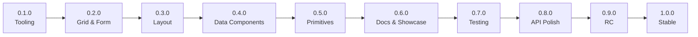
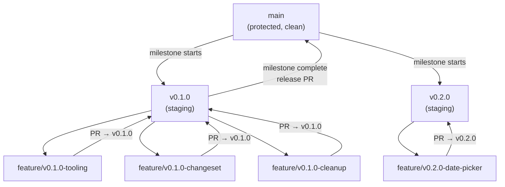
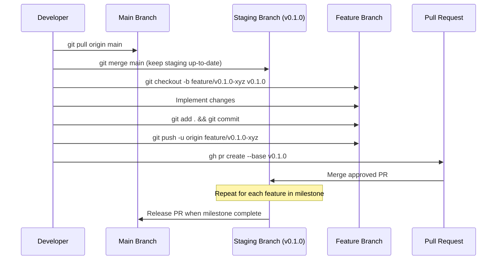

# Version Roadmap: 0.0.1 → 1.0.0

## Version Convention

This project follows **Semantic Versioning (SemVer)**: `MAJOR.MINOR.PATCH`.

During the `0.x.x` phase, the API is considered **unstable**. Breaking changes may occur in any `0.x` release. Once the API stabilizes, the project will bump to `1.0.0`, at which point SemVer guarantees apply:
- **MAJOR:** Breaking API changes
- **MINOR:** New features (backward-compatible)
- **PATCH:** Bug fixes (backward-compatible)

Version management is handled by **Changesets** (`@changesets/cli`). See ADR-003 for the full decision rationale.

## Active Milestone

See `docs/VERSION_STATUS.md` for the current target version and milestone progress.

---

## Milestone Breakdown

### v0.1.0 — Tooling & Workflow Foundation

**Theme:** Establish versioning infrastructure, branch discipline, and codebase cleanup.

**Scope:**
- Install and configure `@changesets/cli` for monorepo version management
- Add `changeset` workflow: `pnpm changeset` → commit `.changeset/*.md` → merge → CI auto-versions
- Create GitHub branch protection rules (no direct pushes to `main`)
- Create PR template (`.github/pull_request_template.md`)
- Define branch naming conventions (`feature/*`, `fix/*`, `docs/*`, `release/*`)
- Add `CHANGELOG.md` generation via Changesets
- Codebase cleanup: fix known file structure violations (multi-export files in `mock-schemas.ts`, `server/schemas.ts`, `server/data.ts`)
- Update `packages/core/package.json` version to `0.1.0`
- Update `apps/showcase/package.json` version to `0.1.0`
- Create `.github/workflows/release.yml` for automated versioning + changelog

**Enforcement files created:**
- `.clinerules/workspace-versioning.md`
- `docs/VERSION_STATUS.md`
- Updates to `.clinerules/hooks/PreToolUse.ps1`
- Updates to `.clinerules/workspace-workflows.md`

**Exit Criteria:**
- [ ] `pnpm changeset` works and generates changeset files
- [ ] `pnpm changeset version` bumps package versions and updates CHANGELOGs
- [ ] GitHub branch protection is configured on the remote repo
- [ ] PR template exists and is used for all merges
- [ ] All file structure violations from `.context.md` are resolved
- [ ] Both packages are at version `0.1.0`
- [ ] `pnpm build` passes with zero errors

---

### v0.2.0 — Enhanced Grid & Form Features

**Theme:** Complete the "core data interaction" experience — the bread and butter of schema-driven UI.

**Scope:**
- **Virtualized Scrolling:** Integrate `@tanstack/react-virtual` into `SchemaGrid` for large datasets (10k+ rows). Add `virtualScroll` option to `GridSchema`.
- **DatePicker Primitive:** Calendar-based date picker (not native `input[type=date]`). New `DatePicker` in Layer 1, injected via `PrimitivesContext`. Update `'date'` field type to use it.
- **Multi-Select / TagInput:** New field type `'multiselect'` with `TagInput` primitive. Supports `options`, `maxSelections`, `creatable` flags. Add `MultiSelectConfig` to `FieldSchema`.
- **Form Wizard / Multi-Step:** New `SchemaWizard` renderer. `WizardSchema` defines steps (array of `FormSchema`), step navigation, and validation per step. Supports linear and non-linear step flows.
- **Column Reordering:** Drag-and-drop column reordering in `SchemaGrid`. Uses `@dnd-kit/core` or similar. Add `columnReorder: boolean` to `GridSchema`.

**New Types:**
- `VirtualScrollConfig` — enabled, overscan, row height
- `DatePickerConfig` — min, max, format, locale
- `MultiSelectConfig` — options, maxSelections, creatable
- `WizardSchema` — steps, navigation, validation mode
- `WizardStep` — title, schema, validation

**New Primitives:**
- `DatePicker` — calendar overlay, configurable format
- `TagInput` — tag chips with add/remove

**New Renderers:**
- `SchemaWizard` — step-based form renderer

**Exit Criteria:**
- [ ] Grid with 10k+ rows scrolls smoothly via virtualization
- [ ] DatePicker renders a calendar overlay for `type: 'date'` fields
- [ ] Multi-select field allows adding/removing multiple values
- [ ] Form wizard navigates between steps with per-step validation
- [ ] Grid columns can be reordered via drag-and-drop
- [ ] All new features have showcase demo routes
- [ ] `pnpm build` passes with zero errors

---

### v0.3.0 — Layout System

**Theme:** The "EXT.NET Border Layout" — compose entire dashboards and application shells from JSON.

This is the largest single milestone. It may be broken into sub-versions (0.3.0, 0.3.1, 0.3.2) during implementation.

**Scope:**
- **SchemaLayout Engine:** A schema-driven layout system supporting multiple layout managers:
  - **Border Layout** — north/south/east/west/center regions with resizable splitters
  - **Accordion Layout** — vertically stacked collapsible panels
  - **Card / Stack Layout** — shows one child panel at a time (tab-less navigation)
  - **HBox Layout** — horizontal flexbox distribution
  - **VBox Layout** — vertical flexbox distribution
- **SchemaPanel** — the atomic unit of layout. Collapsible, resizable, title-bearing container. Supports header, footer, toolbar regions.
- **SchemaTabs** — tab-based panel switching. Schema-driven tab configuration with lazy rendering.
- **SchemaDashboard** — top-level composition component. Accepts a `DashboardSchema` that composes panels, tabs, forms, and grids into a full application shell.
- **Splitter Primitive** — draggable divider between layout regions. New Layer 1 primitive.

**New Types:**
- `LayoutSchema` — layout type, regions, children
- `LayoutRegion` — position, size, resizable, collapsible, min/max size
- `LayoutPanel` — title, content, collapsed state
- `DashboardSchema` — root dashboard definition composing multiple layouts
- `TabSchema` — tabs configuration, tab items
- `TabItem` — label, content schema, icon, disabled

**New Primitives:**
- `Splitter` — draggable resize handle
- `Panel` — collapsible container with header

**New Renderers:**
- `SchemaLayout` — renders layout managers
- `SchemaPanel` — renders individual panels
- `SchemaTabs` — renders tab panels
- `SchemaDashboard` — renders full dashboard composition

**Exit Criteria:**
- [ ] Border layout renders with 5 regions, all resizable
- [ ] Accordion layout expands/collapses panels
- [ ] Card layout switches between panels
- [ ] HBox/VBox layouts distribute children correctly
- [ ] SchemaTabs renders tabs with lazy content
- [ ] SchemaDashboard composes a full dashboard from JSON
- [ ] All layouts are responsive
- [ ] Showcase has a full dashboard demo route
- [ ] `pnpm build` passes with zero errors

---

### v0.4.0 — Advanced Data Components

**Theme:** Tree panels, charts, and hybrid data views for complex business applications.

**Scope:**
- **SchemaTree** — hierarchical tree panel with:
  - Lazy loading (async node expansion)
  - Node expand/collapse with icons
  - Checkbox selection mode (single, multi)
  - Drag-and-drop node reordering
  - Context menu support
  - Node rendering customization via schema
- **SchemaChart** — chart component with schema-driven configuration:
  - Chart types: line, bar, pie, area, scatter, doughnut
  - Data series configuration from schema
  - Axis labels, legends, tooltips
  - Responsive sizing
  - Theme integration (matches app theme)
  - Library: Recharts (React-native, composable, widely used)
- **SchemaTreeGrid** — hybrid tree + grid:
  - Expandable rows with child data
  - Hierarchical column structure
  - Lazy loading of child nodes
  - Tree lines and expand/collapse icons
- **Real-time Data Patterns:**
  - Polling configuration on `GridSchema` and `TreeSchema`
  - Data refresh hooks (`onDataStale`, `onDataRefresh`)
  - Optimistic update helpers

**New Types:**
- `TreeSchema` — tree configuration, root nodes, selection mode
- `TreeNodeSchema` — node data, children, icon, expanded, selected
- `ChartSchema` — chart type, series, axes, legend config
- `ChartSeries` — data source, color, label, type
- `TreeGridSchema` — hybrid tree + grid configuration
- `RealtimeConfig` — polling interval, refresh strategy

**New Primitives:**
- (None — tree, chart, tree-grid are all engine-level renderers consuming injected primitives)

**New Dependencies:**
- `recharts` — chart rendering library
- Possibly `@dnd-kit/core` for tree node drag-and-drop (if not already added in v0.2.0)

**New Renderers:**
- `SchemaTree` — tree panel renderer
- `SchemaChart` — chart renderer
- `SchemaTreeGrid` — hybrid tree + grid renderer

**Exit Criteria:**
- [ ] SchemaTree renders hierarchical data with expand/collapse
- [ ] SchemaTree supports lazy loading of child nodes
- [ ] SchemaChart renders all 6 chart types
- [ ] SchemaChart data is fully schema-driven
- [ ] SchemaTreeGrid renders expandable grid rows
- [ ] Real-time polling updates grid/tree data
- [ ] Showcase has demo routes for tree, chart, and tree-grid
- [ ] `pnpm build` passes with zero errors

---

### v0.5.0 — Complete Primitive Library

**Theme:** Wrap all shadcn/ui components as injectable Layer 1 primitives.

**Scope:**
- Audit all shadcn/ui components and categorize:
  - **Schema-driven** (already have engine types): Input, Select, Checkbox, Textarea, Table, Badge, Button, Dialog, DropdownMenu
  - **Pure wrappers** (Layer 1 primitives): Accordion, Alert, AspectRatio, Avatar, Breadcrumb, Calendar, Card, Carousel, Collapsible, Command, ContextMenu, Drawer, Form, HoverCard, InputOTP, Menubar, NavigationMenu, Pagination, Popover, Progress, RadioGroup, Resizable, ScrollArea, Separator, Sheet, Sidebar, Skeleton, Slider, Switch, Table, Tabs, Toggle, ToggleGroup, Tooltip
- For each pure wrapper:
  - Create a file in `packages/core/src/primitives/`
  - Export from `primitives/index.ts`
  - Ensure consistent prop interfaces
  - Ensure it works when injected via `PrimitivesContext`
- For schema-driven components not yet wrapped:
  - Create schema types in `engine/types/`
  - Create validators in `engine/validators/`
  - Create renderers in `engine/renderers/`
  - Add showcase demo route
- Ensure every primitive has TypeScript types exported

**Exit Criteria:**
- [ ] All shadcn/ui components have a corresponding Layer 1 primitive wrapper
- [ ] `PrimitiveComponents` interface includes all wrapped components
- [ ] Each primitive has consistent API patterns
- [ ] All primitives work when injected via `PrimitivesContext`
- [ ] Showcase demonstrates key primitives
- [ ] `pnpm build` passes with zero errors

---

### v0.6.0 — Documentation & Showcase Site

**Theme:** Transform the showcase app into a full documentation/demo site inspired by the EXT.NET dashboard.

**Scope:**
- **Sidebar Navigation:** Component categories (Forms, Grids, Layouts, Trees, Charts, Primitives, Advanced Examples)
- **Component Documentation Pages:**
  - Description and purpose
  - Props/API reference (auto-generated from TSDoc)
  - Schema type reference with all configurable properties
  - Live interactive examples with code snippets
- **Interactive Playground:** Edit schema JSON in a code editor, see live result. Powered by a Monaco Editor or similar.
- **Code Examples:**
  - Basic usage for each component
  - Advanced composite examples:
    - Full dashboard (layout + grid + form + chart)
    - Master-detail view (grid selection → form edit)
    - Wizard with conditional steps
    - Tree with drag-and-drop + context menu
- **Getting Started Guide:**
  - Installation instructions
  - Quick start (create a basic form/grid)
  - PrimitivesContext setup
  - Schema basics tutorial
- **Deployment Setup:**
  - Deploy to Vercel (TanStack Start native)
  - Custom domain configuration
  - CI/CD for automatic deployment on merge to main

**New Showcase Routes:**
- `/docs` — documentation home
- `/docs/getting-started` — installation guide
- `/docs/components/*` — per-component documentation
- `/docs/examples/*` — advanced examples
- `/playground` — interactive schema editor

**Exit Criteria:**
- [ ] Showcase has sidebar navigation with all component categories
- [ ] Each component has a documentation page with live examples
- [ ] Interactive playground allows editing schema JSON with live preview
- [ ] At least 3 advanced composite examples exist
- [ ] Getting Started guide is complete
- [ ] Documentation site deploys to Vercel
- [ ] `pnpm build` passes with zero errors

---

### v0.7.0 — Testing Suite

**Theme:** Full test coverage across unit, integration, and E2E levels.

**Scope:**
- **Test Infrastructure:**
  - Install and configure Vitest (unit/integration)
  - Install and configure Playwright (E2E)
  - Create test utilities: `renderWithProviders()`, `mockSchemas`, `mockData`
  - Add `test` and `test:e2e` scripts to all `package.json` files
  - CI pipeline runs full test suite on every PR
- **Unit Tests (packages/core):**
  - All type files: verify type shapes, branded types, readonly enforcement
  - All validators: Zod schema validation with valid/invalid inputs
  - All helpers: `evaluateCondition`, `deepFreeze`, `resolveMessage`, `asDataKey`
  - Primitive components: shallow render tests
- **Integration Tests (packages/core):**
  - `SchemaForm`: render with various field types, validation, conditional visibility, submit/cancel
  - `SchemaGrid`: render with data, sorting, filtering, pagination, column visibility, status rendering
  - `SchemaLayout`: render border/accordion/card/hbox/vbox layouts
  - `SchemaTree`: render tree, expand/collapse, selection
  - `SchemaChart`: render all chart types
  - `SchemaWizard`: step navigation, validation per step
  - `SchemaTabs`: tab switching, lazy rendering
  - `FieldRenderer`: all field types render correct components
- **E2E Tests (apps/showcase):**
  - All demo routes load without errors
  - Form submission flow (fill fields → submit → success)
  - Grid interaction flow (sort → filter → paginate → select row)
  - Layout interaction (resize regions → collapse panels)
  - Tree interaction (expand → select → drag node)
  - Documentation site navigation (sidebar → component page → code example)
- **Coverage Target:** 80%+ for `packages/core`

**New Dependencies:**
- `vitest` — unit/integration test runner
- `@testing-library/react` — React component testing
- `@testing-library/jest-dom` — DOM assertions
- `@testing-library/user-event` — user interaction simulation
- `playwright` — E2E test runner
- `@playwright/test` — Playwright test utilities
- `jsdom` — DOM environment for Vitest

**Exit Criteria:**
- [ ] `pnpm test` runs all unit + integration tests
- [ ] `pnpm test:e2e` runs all E2E tests
- [ ] Code coverage >= 80% for `packages/core`
- [ ] CI pipeline runs tests on every PR and blocks merge on failure
- [ ] All existing showcase routes have E2E tests
- [ ] `pnpm build` passes with zero errors

---

### v0.8.0 — API Polish & TSDoc

**Theme:** Finalize public API, add comprehensive documentation, and prepare for public release.

**Scope:**
- **TSDoc Comments:**
  - Add TSDoc to every exported type, interface, function, and component in `packages/core`
  - Include `@param`, `@returns`, `@example` tags
  - Generate API reference documentation from TSDoc (TypeDoc or similar)
- **Public API Audit:**
  - Verify no internal types leak through exports
  - Ensure consistent naming across all exports
  - Remove any `ComponentType<any>` escape hatches (replace with proper types)
  - Verify tree-shaking works (only import what you use)
- **Migration Guide:**
  - Document all breaking changes from `0.0.1` to `1.0.0`
  - Provide before/after code examples for each change
- **Architecture Deep-Dive:**
  - Expanded ARCHITECTURE.md with full design rationale
  - Contributing guide
  - Plugin/extension guide (how to add custom primitives, custom renderers)
- **Package Naming:**
  - Finalize the real npm package name
  - Update all references from `@my-framework/core` to the final name
  - Reserve the npm package name

**Exit Criteria:**
- [ ] All public exports have TSDoc comments with examples
- [ ] API reference documentation is generated and accessible
- [ ] No internal types leak through public exports
- [ ] Migration guide is complete
- [ ] Package name is finalized and reserved on npm
- [ ] `pnpm build` passes with zero errors

---

### v0.9.0 — Release Candidate

**Theme:** Final QA, performance optimization, and stability verification before 1.0.0.

**Scope:**
- **Performance Optimization:**
  - Bundle size analysis (verify tree-shaking works)
  - Memoization audit (React.memo, useMemo, useCallback where needed)
  - Lazy loading audit (code-split heavy components)
  - Render performance profiling
- **Accessibility Audit:**
  - WCAG 2.1 AA compliance verification
  - Keyboard navigation for all interactive components
  - Screen reader testing (VoiceOver, NVDA)
  - Color contrast verification
- **Breaking Change Review:**
  - Final review of all public APIs
  - Confirm no unintended breaking changes since v0.8.0
- **QA Pass:**
  - Manual testing of all features
  - Cross-browser testing (Chrome, Firefox, Safari, Edge)
  - Mobile responsive testing
  - All tests pass (unit + integration + E2E)
- **Pre-release:**
  - Publish `0.9.0-rc.1` to npm
  - Gather feedback from any early adopters
  - Fix any critical issues → `0.9.0-rc.2`, etc.
- **Documentation Finalization:**
  - Proofread all documentation
  - Verify all code examples work
  - Verify all links are valid

**Exit Criteria:**
- [ ] Bundle size is reasonable (<100KB gzipped for core)
- [ ] WCAG 2.1 AA compliance achieved
- [ ] All tests pass on all major browsers
- [ ] Pre-release published and tested
- [ ] No critical or high-severity bugs open
- [ ] `pnpm build` passes with zero errors

---

### v1.0.0 — Stable Release

**Theme:** Public launch. API stability guarantee begins.

**Scope:**
- Publish `@<final-name>/core@1.0.0` to npm
- Deploy documentation site to public URL
- Auto-generated `CHANGELOG.md` from Changesets
- README.md updated with final badges (npm version, CI status, coverage)
- Announcement (GitHub Discussions, social media, etc.)
- SemVer contract begins: no breaking changes without a major version bump

**Exit Criteria:**
- [ ] Package published to npm under final name
- [ ] Documentation site live at public URL
- [ ] CHANGELOG.md auto-generated and complete
- [ ] README.md has final badges and description
- [ ] All tests pass
- [ ] All milestones in this roadmap are marked COMPLETE

---

## Version Dependency Flow



NOTE: v0.5.0 and v0.6.0 could potentially run in parallel since they are largely independent (primitives wrapping vs. documentation). However, v0.6.0 documentation should cover the primitives from v0.5.0, so the logical order is maintained.

---

## Branching Convention

### Branch Types

| Branch Pattern | Purpose | Example |
|----------------|---------|---------|
| `v{VERSION}` | Long-running staging branch for a milestone | `v0.1.0`, `v0.2.0` |
| `feature/*` | New feature development | `feature/v0.2.0-date-picker` |
| `fix/*` | Bug fixes | `fix/grid-pagination-off-by-one` |
| `docs/*` | Documentation changes | `docs/getting-started-guide` |
| `release/*` | Release preparation | `release/v0.2.0` |
| `refactor/*` | Code refactoring | `refactor/extract-layout-helpers` |

Branch names SHOULD include the target version for feature branches (e.g., `feature/v0.2.0-date-picker`).

### Staging Branch Flow

Each milestone has a long-running staging branch (e.g., `v0.1.0`) that acts as the integration target for all feature branches during that milestone. The staging branch merges into `main` only when the milestone is complete.

**Rules:**
- Feature branches MUST be based on the current milestone's staging branch
- Pull Requests from feature branches MUST target the staging branch as base
- The staging branch MUST be kept up-to-date with `main` by merging `main` into it before creating new feature branches
- The staging branch merges into `main` only when the milestone is complete (via a release PR)
- Direct commits to `main` are forbidden



### Typical Workflow



---

## Changeset Workflow

```mermaid
sequenceDiagram
    participant Dev as Developer
    participant Branch as Feature Branch
    participant PR as Pull Request
    participant CI as GitHub Actions
    participant Staging as Staging Branch
    participant Main as Main Branch

    Dev->>Branch: Create feature/v0.2.0-date-picker off v0.2.0
    Dev->>Branch: Implement DatePicker
    Dev->>Branch: Run `pnpm changeset`
    Note over Branch: Creates .changeset/spotty-lions-123.md
    Dev->>PR: Open PR targeting v0.2.0 (not main)
    CI->>PR: Run tests + typecheck + build
    PR->>Staging: Merge approved PR into v0.2.0
    Note over Staging: Repeat for all features in milestone
    Staging->>Main: Release PR when milestone complete
    CI->>Main: Changeset action runs
    CI->>Main: Bumps version, updates CHANGELOG
    CI->>Main: Publishes to npm (if release branch)
