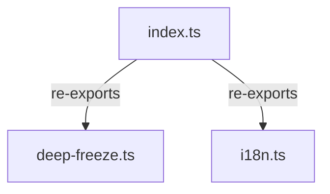

# helpers/ - Context Map

## File Inventory
| File | Export Name | Export Type | Description |
|------|-------------|-------------|-------------|
| i18n.ts | resolveMessage | function | Resolves localized messages from i18n config |
| deep-freeze.ts | deepFreeze | function | Recursively freezes an object for runtime immutability |
| index.ts | (barrel) | — | Re-exports all helpers |

## Internal Relationships

## External Dependencies
- `deep-freeze.ts` --> imports `DeepFrozen` from `../types/readonly-deep.ts`