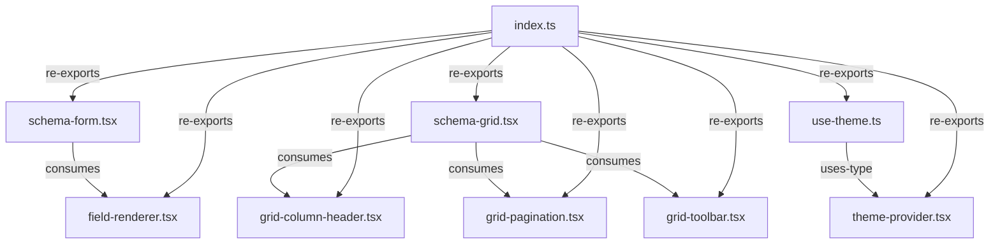

# Renderers Directory - Context Map

React renderers that consume schemas and use Layer 1 primitives via PrimitivesContext.

## File Inventory

| File | Export Name | Export Type | Description |
|------|-------------|-------------|-------------|
| field-renderer.tsx | FieldRenderer | function | Renders individual form fields based on FieldSchema |
| schema-form.tsx | SchemaForm | function | Renders complete form from FormSchema |
| schema-grid.tsx | SchemaGrid | function | Renders data grid from GridSchema with optional virtual scrolling via @tanstack/react-virtual |
| grid-column-header.tsx | GridColumnHeader | function | Grid column header with sorting |
| grid-pagination.tsx | GridPagination | function | Grid pagination controls |
| grid-toolbar.tsx | GridToolbar | function | Grid toolbar with filters/actions |
| theme-provider.tsx | ThemeProvider, ThemeContext | function, const | Theme context provider and exported context |
| use-theme.ts | useTheme | function | Hook to consume ThemeContext |
| index.ts | *(barrel)* | re-export | Re-exports all renderers |

## Internal Relationships

## External Dependencies

- `field-renderer.tsx` --> imports from `../../primitives/address-data.ts` (Layer 1: AddressData)
- `field-renderer.tsx` --> imports from `../types` (FieldSchema, FieldType)
- `schema-form.tsx` --> imports from `../context/primitives-context.tsx` (usePrimitives)
- `schema-form.tsx` --> imports from `../types` (FormSchema, FormSubmitHandler, FieldSchema)
- `schema-grid.tsx` --> imports from `../context/primitives-context.tsx` (usePrimitives)
- `schema-grid.tsx` --> imports from `../types` (GridSchema, GridColumnSchema, PaginationConfig, VirtualScrollConfig)
- `schema-grid.tsx` --> imports from `@tanstack/react-virtual` (useVirtualizer)
- `grid-toolbar.tsx` --> imports from `../context/primitives-context.tsx` (usePrimitives)
- `grid-toolbar.tsx` --> imports from `../types` (GridColumnSchema)
- `grid-toolbar.tsx` --> imports from `../helpers/i18n.ts` (resolveMessage)
- `theme-provider.tsx` --> imports from `../types` (ThemeConfig)
- `use-theme.ts` --> imports from `../types` (ThemeConfig)