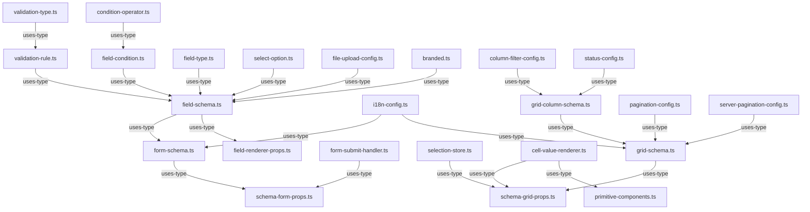

# types/ - Context Map

## File Inventory
| File | Export Name | Export Type | Description |
|------|-------------|-------------|-------------|
| branded.ts | Brand, FieldId, DataKey | type | Branded types for type-safe IDs |
| readonly-deep.ts | ReadonlyDeep, DeepFrozen | type | Recursive readonly wrapper types |
| condition-operator.ts | ConditionOperator | type | String literal union for condition operators |
| validation-type.ts | ValidationType | type | String literal union for validation types |
| field-type.ts | FieldType | type | Union of all supported field types |
| select-option.ts | SelectOption | interface | Option for select/radio fields |
| validation-rule.ts | ValidationRule | interface | Validation constraint for a field |
| field-condition.ts | FieldCondition | interface | Conditional visibility rule |
| file-upload-config.ts | FileUploadConfig | interface | File upload constraints |
| field-schema.ts | FieldSchema | interface | Schema definition for a form field |
| i18n-config.ts | I18nConfig | interface | Internationalization config |
| form-schema.ts | FormSchema | interface | Schema definition for an entire form |
| pagination-config.ts | PaginationConfig | interface | Client-side pagination settings |
| column-filter-config.ts | ColumnFilterConfig | interface | Column-level filter config |
| status-config.ts | StatusConfig | interface | Status badge variant mapping |
| grid-column-schema.ts | GridColumnSchema | interface | Schema definition for a grid column |
| server-pagination-config.ts | ServerPaginationConfig | interface | Server-side pagination settings |
| theme-config.ts | ThemeConfig | interface | Theme customization config |
| grid-schema.ts | GridSchema | interface | Schema definition for an entire grid |
| primitive-components.ts | PrimitiveComponents | interface | Map of injectable UI components |
| form-submit-handler.ts | FormSubmitHandler | type | Handler type for form submission |
| selection-store.ts | SelectionStore | interface | Generic selection state store |
| field-renderer-props.ts | FieldRendererProps | interface | Props for FieldRenderer component |
| schema-form-props.ts | SchemaFormProps | interface | Props for SchemaForm component |
| schema-grid-props.ts | SchemaGridProps | interface | Props for SchemaGrid component |
| cell-value-renderer.ts | CellValueRenderer | type | Custom cell renderer function type |
| index.ts | (barrel) | — | Re-exports all types |

## Internal Relationships

## External Dependencies
- All files are pure TypeScript type definitions (no runtime dependencies)
- `index.ts` re-exports all types listed above as the directory barrel file
