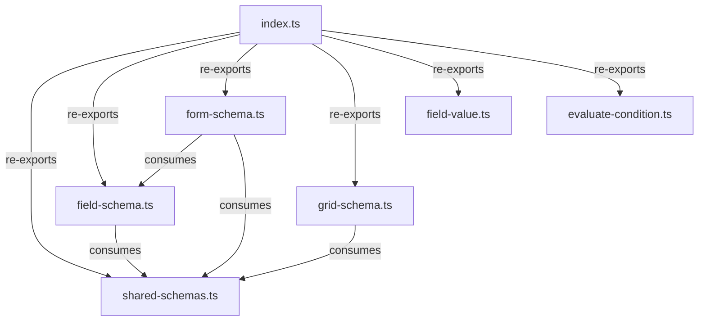

# validators/ - Context Map

## File Inventory

| File | Export Name | Export Type | Description |
|------|-------------|-------------|-------------|
| shared-schemas.ts | fieldTypeSchema, paginationConfigSchema, columnFilterConfigSchema, statusConfigSchema, serverPaginationConfigSchema, i18nConfigSchema, ValidationResult | const/type | Shared Zod schemas and result type |
| field-schema.ts | fieldSchemaValidator, validateFieldSchema | const/function | Zod schema and validator for FieldSchema |
| form-schema.ts | formSchemaValidator, validateFormSchema | const/function | Zod schema and validator for FormSchema |
| grid-schema.ts | gridSchemaValidator, gridColumnSchemaValidator, validateGridSchema | const/function | Zod schemas and validator for GridSchema |
| field-value.ts | validateFieldValue | function | Runtime field value validation |
| evaluate-condition.ts | evaluateCondition | function | Evaluates FieldCondition against form values |
| index.ts | (barrel) | — | Re-exports all validators |

## Internal Relationships

## External Dependencies
- `field-schema.ts` --> imports type from `../types`
- `grid-schema.ts` --> imports type from `../types` (via shared-schemas)
- `shared-schemas.ts` --> imports from `zod`