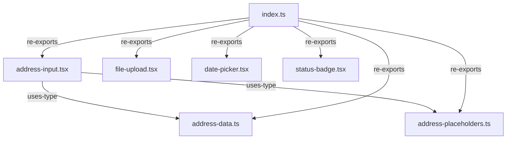

# Primitives Layer - Context Map

Layer 1: Generic UI wrappers with no schema knowledge. Imports only React and external UI libraries.

## File Inventory

| File | Export Name | Export Type | Description |
|------|-------------|-------------|-------------|
| address-data.ts | AddressData | interface | Structured address data shape |
| address-placeholders.ts | AddressPlaceholders | interface | Placeholder text for address sub-fields |
| address-input.tsx | AddressInput | function | Composite address entry component |
| file-upload.tsx | FileUpload | function | File upload component with drag-and-drop |
| date-picker.tsx | DatePicker | function | Date picker with calendar popup (date-fns + react-day-picker) |
| status-badge.tsx | StatusBadge | function | Status indicator badge component |
| index.ts | *(barrel)* | re-export | Re-exports all primitives |

## Internal Relationships

## External Dependencies

- None (Layer 1 imports only React and external UI libraries)