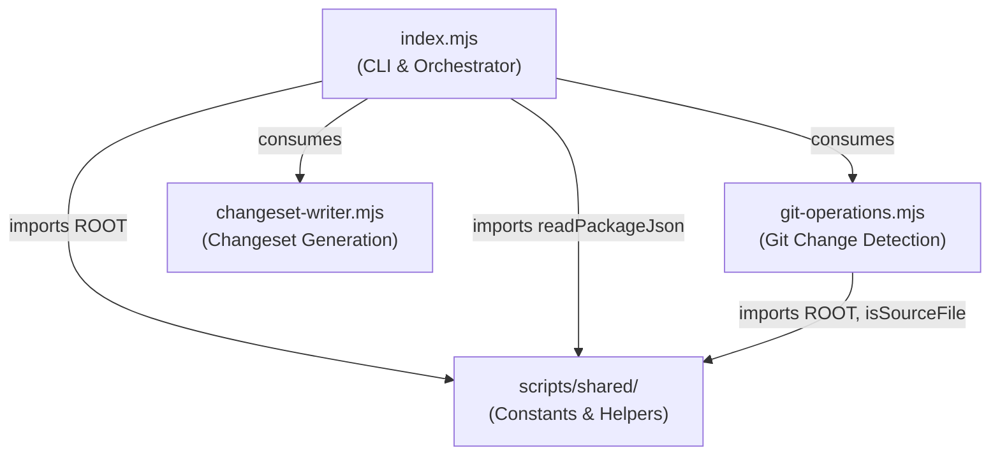

# Auto-Changeset Generator

> **Non-interactive changeset creation** for `packages/core/src/` modifications.

Detects changed TypeScript files in the core package via git and generates a patch-level changeset file with a derived description.

## Architecture



## Module Responsibilities

| Module | Purpose | Primary Export |
|--------|---------|---------------|
| `index.mjs` | CLI entry point, orchestrates detection → generation → writing | `main()` |
| `git-operations.mjs` | Detects changed files in `packages/core/src/` via git | `getChangedCoreFiles()` |
| `changeset-writer.mjs` | Generates changeset filename/content and writes to disk | `generateChangeset()`, `writeChangeset()` |

## Usage

```bash
# Auto-detect changed files from git
node scripts/auto-changeset/index.mjs

# Explicit file list
node scripts/auto-changeset/index.mjs --files packages/core/src/engine/types/field-schema.ts
```

## Behavior

- Only triggers for files under `packages/core/src/` (excluding `.d.ts`, `.gen.ts`, `.test.ts`, `.spec.ts`)
- Skips generation if a changeset already exists in `.changeset/`
- Generates a patch-level changeset with a description derived from file names
- Uses MD5 hash of file names + timestamp for unique changeset IDs