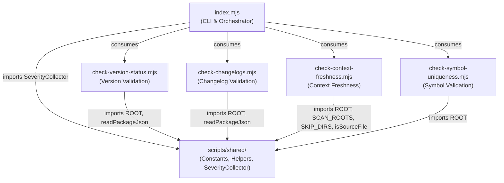

# Compliance Check

> **Post-build validation runner** for project health checks.

Validates version consistency, changelog existence, context map freshness, and symbol index integrity after `pnpm build`. Output is structured for AI consumption with violations, warnings, and suggestions.

## Architecture



## Module Responsibilities

| Module | Purpose | Primary Export |
|--------|---------|---------------|
| `index.mjs` | CLI entry point, orchestrates all checks and prints report | `main()` |
| `check-version-status.mjs` | VERSION_STATUS.md consistency validation | `checkVersionStatus()` |
| `check-changelogs.mjs` | CHANGELOG.md existence for published packages | `checkChangelogs()` |
| `check-context-freshness.mjs` | Context map freshness and description quality | `checkContextFreshness()` |
| `check-symbol-uniqueness.mjs` | Symbol index JSON integrity validation | `checkSymbolUniqueness()` |

## Usage

```bash
# Run via pnpm (postbuild hook)
pnpm build

# Run standalone
pnpm compliance
```

## Exit Code

Always exits 0 — violations are informational for AI context, not build-blocking.