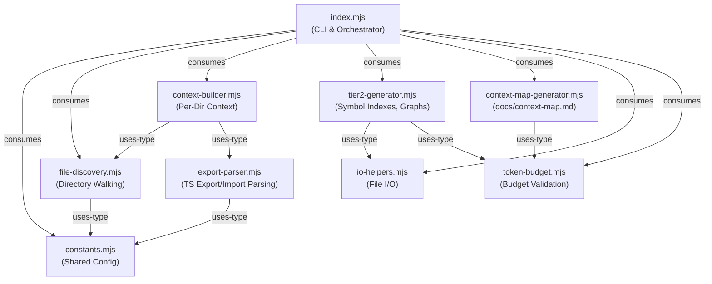

# AI Context Generator

> **Tiered context system** for AI model awareness across a fragmented file structure.

Auto-generates `.context.json` per directory (Tier 1), symbol indexes and dependency graphs (Tier 2), and `docs/context-map.md` from collected context data.

## Architecture



## Module Responsibilities

| Module | Purpose | Primary Export |
|--------|---------|---------------|
| `index.mjs` | CLI entry point, orchestration | `main()` |
| `constants.mjs` | Shared config, layer mapping, regex patterns | `ROOT`, `SCAN_ROOTS`, `getLayer()` |
| `file-discovery.mjs` | Recursive directory walking, source file listing | `discoverSourceDirs()`, `getSourceFiles()` |
| `export-parser.mjs` | Single-pass TypeScript export/import extraction | `parseFileExports()` |
| `token-budget.mjs` | Token estimation and budget validation | `estimateTokens()`, `validateTokenBudget()` |
| `io-helpers.mjs` | JSON serialization, file writing, check mode | `writeTier2File()`, `serializePretty()` |
| `context-builder.mjs` | Per-directory context building, merge logic | `buildContextForDir()` |
| `tier2-generator.mjs` | Symbol indexes, impact graph, directory index | `generateSymbolIndexes()` |
| `context-map-generator.mjs` | Auto-generates `docs/context-map.md` | `generateContextMap()` |

## Usage

```bash
# Incremental generation (skips fresh directories)
pnpm generate-context

# Force regenerate all files
pnpm generate-context:force

# Check freshness without writing (exits 1 on drift)
pnpm generate-context:check
```

## CLI Flags

| Flag | Description |
|------|-------------|
| `--force` | Regenerate all files regardless of mtime |
| `--check` | Compare without writing; exit 1 on drift |
| `--verbose` | Show detailed progress output |

## Output Tiers

### Tier 1 — `.context.json` (per directory)

Pretty-printed JSON files placed alongside source code. Hand-crafted `desc`, `deprecated`, and `tests` fields are preserved during regeneration.

### Tier 2 — `docs/ai/*.json` (compressed)

- `symbol-index-layer{1,2,3}.json` — Symbol-to-file mapping per layer
- `symbol-index-manifest.json` — Aggregated symbol counts
- `impact-graph.json` — Reverse dependency graph
- `directory-index.json` — Directory-to-purpose mapping

### Bonus — `docs/context-map.md`

Auto-generated Mermaid diagrams showing layer dependencies, per-layer directory graphs, and cross-layer import relationships.

## External Consumers

- `scripts/compliance-check.mjs` — Imports `ROOT`, `SCAN_ROOTS`, and `getLayer()` from `constants.mjs`