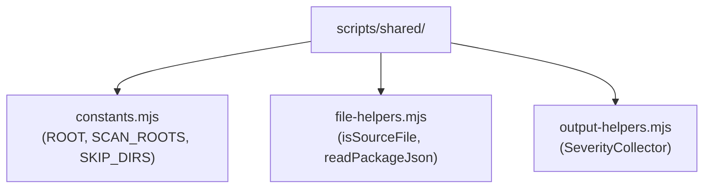
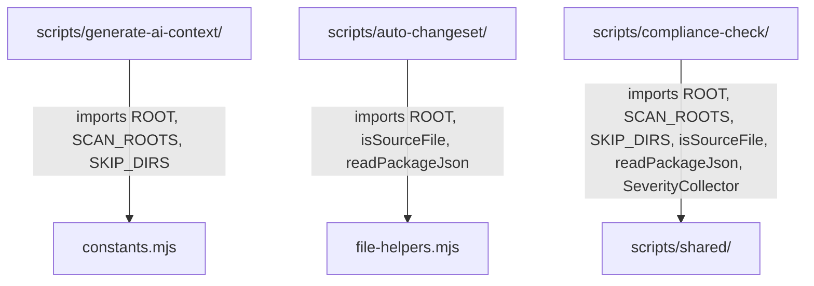

# Shared Script Utilities

> **Canonical utilities** consumed by all script subsystems (`generate-ai-context`, `auto-changeset`, `compliance-check`).

Eliminates code duplication by providing a single source of truth for project constants, file helpers, and output formatting.

## Architecture



## Module Responsibilities

| Module | Purpose | Primary Export |
|--------|---------|---------------|
| `constants.mjs` | Project root path, scan roots, skip directories | `ROOT`, `SCAN_ROOTS`, `SKIP_DIRS` |
| `file-helpers.mjs` | Source file detection, package.json reading | `isSourceFile()`, `readPackageJson()` |
| `output-helpers.mjs` | Structured report formatting with severity levels | `SeverityCollector` |

## Dependency Graph



## Usage

```js
import { ROOT, SCAN_ROOTS, SKIP_DIRS } from '../shared/constants.mjs'
import { isSourceFile, readPackageJson } from '../shared/file-helpers.mjs'
import { SeverityCollector } from '../shared/output-helpers.mjs'